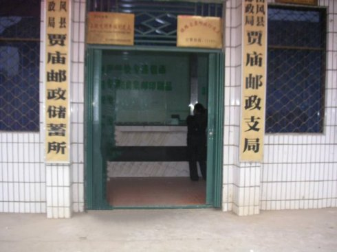

<p align="center"></p>
<p>
  来源：<a href="http://blog.sina.com.cn/sjg0903">新浪博客</a>
</p>
<p>
  作者：新浪博主 - 十进宫资产重组之道
</p>

### 山区磨炼（一）
18.生产队林场
 
.................

.................
 
第二天一大早，我坐上开往贾庙的敞篷汽车，一路颠簸，经过了平原、丘陵地带，慢慢驶入崎岖的山区，七盘八拐，中午时分终于来到了贾庙。

下车一望，贾庙区就只有一条小街，街上的泥土道路坎坷不平，稀稀拉拉地散布着几十间房子，卫生院就位于小街的后边。看着这所还带有一座小院子的卫生院，我满以为自己将要在这里开始新的生活和工作了。

贾庙区卫生院的陈木樵院长接待了我，他介绍说昨天已经来了四名医学院的学生。没料到寒暄几句话之后，陈院长言归正传，开口说把我安排至革命老苏区的杜皮公社卫生所，也就是说还要下到更低一级的卫生所去。我的心一下子凉了半截，但也不敢流露出一丝的失望情绪来。
 
下午，杜皮公社卫生所的所长汪继堂闻讯后前来接我。汪所长瞧了我一眼，开口只说了一句话：“我们走吧！”他帮我挑着比较沉重的行李，我手提网兜带着一些小东西，两人离开贾庙卫生院，翻山越岭，走过了十几里崎岖的山路。

途中，汪所长领我在一位老革命家歇息了一会儿。这里住着一位老红军漆松林，解放后曾在上海一家大型工厂担任领导，后来主动要求回乡养病。自此之后，我和这家人建立了长期的友情，直到现在还常常往来，这些都是后话。

夕阳西下，将近日落时分我们才崴到杜皮卫生所。这是一个偏僻的山区公社卫生所，几间黄土砖、黑色瓦的平房，座落在一个斜斜的山坡上。如果所长不介绍，我真难相信这里竟是一所救死扶伤的机构。

望着眼前陌生的环境，想到自己将要在这片贫瘠的土地上工作与生活，我内心禁不住一阵伤感。在大城市生活了23年，突然一竿子被直接放到大山沟穷乡僻壤的最底层，一落千丈，如此巨大的城乡落差自己是否能够适应呢？

根据上级的精神，我们这些刚毕业的大学生一律先去基层农村锻炼，“接受贫下中农的再教育”。我们分来贾庙的五名医学院毕业学生，还没有正式工作，首先就来到杜皮公社一座名叫林家山大队的林场，在贫下中农的监督下进行劳动锻炼，改造小“知识分子”的世界观。
 
这里是大别山脉一座偏远的林场，周围环境贫困艰苦，山峦叠障，除了山还是山，倒是应了那一句“这山望着那山高”的老话。

我们和林场的农工们同吃，同住，同劳动，每天给树木剪枝，挖土，种树，锄草，除虫，护苗……万事开头难，开始时劳动的姿势十分别扭，非常不习惯。许多农活我们不懂，就虚心向农工们请教学习，时间长了才慢慢地适应起来。那时节经常万里无云，烈日当头，我们戴着草帽，往往是大汗淋漓，身上被晒得黢黑。

 
有时候正劳动着，一阵山雨随着黑滚滚的乌云疾速飘来，连躲闪的地方都找不到，浇得我们全身上下湿淋淋的，真可谓是“落汤鸡”的狼狈模样。你看着我，我看着你，大家忍不住哈哈笑了起来。

劳累辛苦自不必说，可以默默忍受着，最难受的倒是常常有松毛虫掉到脖子上、胳膊上，皮肤立马泛起一道道的红印，火辣辣的刺痒难忍。那时也没有什么“皮炎平”之类的外用药，只好抹上一些清凉油。

山里还有一种小飞虫叫“蠓子”，比蚊子还小，四处飞得都是，咬得身体上上下下都是红包，不仅吸你的血，还奇痒无比。无可奈何，也只能上下抹一点清凉油，用山沟里的凉水浸浸局部，咬着牙坚持下来。

提起那几个月的劳动锻炼，真可谓是：不会干学着干，干不惯也要干，心里有怨言还得干，顶着烈日干，冒着风雨干，出着“洋相”干，筋疲力尽还得干，渐渐地总算熟悉了林场的那一套活路。

值得庆幸的是，我们一起下放锻炼的这几名大学生尚能和睦相处，同舟共济，在精神上彼此安慰，不存在着互相残杀的现象，没有额外增添一些不必要的苦恼。往往在最艰辛的时候，在苦不堪言的情况下，大家都是互相鼓励着：“要挺住哟。”而据说其他大学生劳动锻炼的场所，存在着不少勾心斗角，矛盾重重的窘况。

生产大队的书记时不时来给我们进行“再教育”，“忆苦思甜”。他对我们的训话比对下放知识青年明显缓和一些，一来知道我们是医学大学生，迟早会出去当医生的，二来我们干活是不拿工分的，不像知识青年需要计工分。倘若给他的亲友治好了一点小病小痛，大队书记的那口气就显得相当客气了。

在伙食上大多吃的是白菜、黑腌菜及咸罗卜，有时连青菜都看不见。每逢吃饭时，往往是一大锅米饭，一盆看不见油星子的菜放在桌子上。山里比城市好一点的是吃新米，不像城里粮库中存放了多年的那种老陈米。新米有米油，吃起来很香，特别是饥饿时不用菜也可以吃上一大碗。

眼巴巴地看着炊事员给每人盛上一碗米饭，大家狼吞虎咽抢着吃起来，顾不得细嚼慢咽，然后马上去盛第二碗，这一碗就只有半碗了。

动作要快，吃完米饭后我和大家一样抢着去吃香喷喷的锅巴，喝甜蜜蜜的米汤。如果把锅巴和米汤煮在一起就成为了锅巴粥，又香又能助消化，别一样的味道。干的稀的凑合起来总算是能够勉强填饱肚皮，至于谈什么“营养”，那完全就是一种奢望了。

有时有事情需要去区里办理，就从林家山走下山来，步行到贾庙区所在的那一条街上。在镇的西头，仅有的一家餐馆卖的是馒头和油饼，那些馒头常常没有发好，面是硬结的，但还是得买上几个带回来。说起那种油饼，一是面没发好，死结的，二是炸油饼用的是黑色棉籽油，炸出的油饼黑不拉几的，但饥馋的我们还是狼吞虎咽，吃得津津有味。然后，就便再去副食品商店买几包一角五分钱一斤的饼干，当成宝贝似的带回林场来留着慢慢“享受”。

我们真正做到了上级规定的同吃同住同劳动的“三同”要求，那年代这个“三同”和“再教育”是针对青年学生们最时髦的名词。私下里，大家开玩笑地自嘲说，我们是在学习越王勾践的“卧薪尝胆”，只不过将来放出去不是做诸侯，而是当医生。正是凭靠这种精诚团结的友谊，让我们顽强地支撑着，度过了最艰难、最困苦的时光。

由于劳动强度大，体力耗费大，我的饭量随之大增。大山里的空气又清新，一天到晚什么也不想，想也无用，真正做到了“清心寡欲”，一倒床就睡到天亮。没料到三个月下来，体力反觉得增强不少，既锻炼了思想又增强了体质，倒算是一个额外的收获吧。

本来上面要求我们这些大学生劳动锻炼半年以上（在军垦农场里的大学生还有劳动一年的情况），后来贾庙卫生院从实际工作出发，向主管部门打了申请报告，说是老苏区缺医少药，卫生院急缺临床医生支援。于是在三个月之后，上级把我们五个人叫来贾庙卫生院开会。也不知道是为了什么，陈院长当场宣布，他们四人留在贾庙街上的区卫生院上班，唯独我一人依然返回杜皮公社卫生所工作。我心里顿时一沉，一种无名的失落感涌上心头。

我黯然地离开了贾庙，默默无语，独自闷闷不乐地向杜皮卫生所走去。

一边走，一边宽慰自己不要怨天尤人，小不忍乱大谋，“物竞天择，适者生存”是自然界的生存规律。我要像贝多芬那样“在不利和艰难的遭遇里百折不挠”，要向《钢铁是怎样炼成的》主人公保尔学习，向那些曾经遭遇过种种不幸的英雄们学习，永不言放弃。我相信一个人无论怎样多遭磨难，“路，还是在自己的脚下”。

### 山区磨炼（二）
19．杜皮小诊所

既然命中注定了要在大山沟里经受一番磨难，我只得面对现实，做好了在这里吃苦的打算。作为一位出生在大城市，长在武汉市区的青年大学生，我虽然过去攀登过不少名山，也曾去通山的农村政治野营和劳动锻练过，但大别山独特的山区环境，仍然使我内心产生着别一样的感受。

大别山是长江、淮河的分水岭，是一条自西向东，横过湖北、安徽、河南三省的大山脉。它的主峰在罗田县天堂寨，海拔1700米，虽不高耸挺拔，却也雄浑浩远，距离黄冈的贾庙不远。我所在的贾庙区杜皮公社，就处在大别山的南麓。

由于我经常被派到各大队巡诊，还要辅导各队的赤脚医生，再加上外出开会、交流和学习等种种原因，因而除了杜皮之外，大崎、金鸡、铁冶、三庙河及杨泗等公社也留下了我的足迹，我就在这方圆几十里的山林内跑来跑去。

贾庙林木森森，山道曲折，真是出门就看山，走路就爬山。对于我这个从小走惯平路，出门骑自行车或坐公交汽车的人来说，确实是一个不小的考验。

一开始行走山路腿子十分的酸痛，时间一长我就感到力不从心。向上爬山时常常汗浸衣衫，头上大汗淋漓，心跳加快，有时难受得心脏好像要跳出来一般，在气喘吁吁中我不得不歇歇脚。下山虽然容易一些，但也是一步一抖，双腿发软，说不出来的难受滋味，所以民间流传着“上山容易下山难”的俗话。

对爬山有了身体力行的切身体会后，我一改过去对农村干部的一些偏见。从前我看见电影和照片上农村干部在山区工作时，总爱披搭着棉袄，原来以为这是农民的闲散作风在作怪，现在才知道他们如此做是有着科学道理的。由于上山时浑身出汗，穿上棉袄只会汗出得更多，只好披着，有利于爬坡。攀到山顶时，山风一阵吹过来，人就会突然感觉发凉，此时就立即穿紧棉袄，系上扣子，可以防止受凉感冒。

我也模仿着当地人们的方式这样处理。另外还带上一条干毛巾，一旦内衣湿透就把毛巾塞进背后擦擦，避免背心处受凉生病。

杜皮卫生所一共七个人。一位所长汪继堂，他不会看病，只管行政，每月到贾庙卫生院进药和开各种会议，兼收挂号费和治疗费。因为大家都是拿工资的，所以这些挂号费、治疗费就算做卫生所的收入。医生就是我和另一位五十多岁的方医生，一名女护士，一个助产士（计划生育），一位男司药。此外，再加一个做饭的师傅，大家都喊他“绿豆壳”爹爹。

在待遇方面，就我一人拿的是国家工资，而所长和其他人都是拿的集体所有制的工资。我一个月42.5元，由县卫生局直接拨到贾庙卫生院，在卫生所里算是最高的。他们十分欢迎我，因为我不占他们的工资指标，又在卫生所里做事干活，真是求之不得。

卫生所条件虽然简陋，但大山里的地皮绰绰有余，住房能够保证一人一间。我住的一间房子将近二十平米，比起城市来说算是十分宽敞的。

刚去杜皮的时候晚上没有电灯，很长一段时间照明点的是煤油灯。后来附近的狗皮崖小水电站开始供电，我们也能享受到电灯照明的乐趣了，只不过灯光比较昏暗，电压不稳，一闪一闪的，书上的字稍微小一点就看不清楚，而且一下子有电一下子停电。

卫生所的厕所建在后面的小山坡上，它是周围一带唯一的用红色砖块盖起来的小小建筑物。我们每每方便时，总要上上下下的，在天气下雨时感到特别的不方便。晚上大家把大小便留在尿壶或痰盂里，第二天一大早就赶快出门，爬坡，往厕所里倒进排泄物，储存起来。

(此处图片缺失，待补充)

（人去物非，这个红砖小厕所48年以后却依然没有变化。原来位于厕所下面的老卫生所已经被撤除，迁移到新的地方去了。厕所背后就是通往六大队的蜿蜒小路）

(此处图片缺失，待补充)
 
农村把粪便看得十分金贵，俗话说：“庄稼一枝花，全靠肥当家”，卫生所在房屋周围的空地上种上不少蔬菜，都是用厕所里的粪便浇的地。我有时也参加汪所长和“绿豆壳”爹爹种菜的活儿，吃着亲自劳动种出来的青菜，心里有一种说不出来的新鲜感。

来到杜皮之后，我对这里的用水感到非常不习惯。山里人吃的水是井水，习惯用一根绳子吊着一个小桶从井中提拉出水来。由于只是一口处在半山坡上的小井，这些水仅仅只够大家吃喝和洗脸用，而洗衣服、鞋袜等，就需要走下坡去使用塘水。
 
塘水位于村头的一处低洼之地，积淀着雨水和山水。平时村民们在这里洗衣、洗菜、淘米、洗手洗脚，牛也在此喝水。常常可以看到牛粪就拉在水塘旁边，所以池塘里的水自然比较浑浊甚至肮脏。天气炎热时塘水所剩不多，更是脏得不行，人们依然还在其中洗涤。

我实在难以忍受这样的状况，只得辛苦一点，耐心地从卫生所门前的小井中，不厌其烦，反复多次地提上一些清水来，用来刷牙、洗澡、洗衣。

平时有病人上门来看病，挂号费是五分钱，这是坐诊标准。如果有人前来请出诊，一般都是比较重的疾病，我们医生就要外出上患者家中诊治，出诊费是两角。

方医生不爱坐诊，他常常是一大早就背上药箱子，到各大队去巡诊，和农民们打成一片。但他的巡诊也有一点个人小算盘，由于人缘关系很熟，他常常在农民家吃饭喝酒，喝完了酒就在农民家中小酣一会，直至日薄西山才慢慢崴回卫生所。他的一天日子过得优哉游哉，可谓是苦中寻乐哟。

这样，日常坐诊的担子大都落在我身上。农民们往往是在早晨上工前、中午收工后和晚上收工后，才有时间前来看病。这样我早晨不能多睡一会懒觉，中午想午睡也不行，晚上也无法较早休息，和城市里的正规生活节奏完全不同，人总是处于一种思想紧张的状态。

如果有人前来叫出诊，大都是急病重病，此时所里只留有我一名医生在，只能由我出诊。我也不像当地医生那样见多不怪、不慌不忙的，而是匆匆忙忙地赶赴，生怕耽误了人家的大事甚或性命。长期如此，吃饭睡觉都无规律，造成我精神上常常感到有一些压力。

即便是出诊，我也尽可能地少给农民增加负担，大多数是赶回卫生所午餐，依然保持着一身典型的学生般习气。有时实在路太远赶不回来，就在农民家吃饭，饭后交一角钱和几两粮票，但农民往往是不收我的钱和粮票的。由于当地的贫困，造就了一种特殊的待客方式，为此我还曾经闹过一个小笑话来。


山区农民淳朴善良，待客热情，对医生更是尊敬有加。他们见面就称呼我们为“先生”，把我们当为座上宾。刚开始我来到农民家里，他们往往做好一大碗面条，上面放有好几片腊肉或者荷包蛋。这对我来说自然是很大的诱惑，心里十分感谢，于是一古脑地吃了一个精光。

后来这件事传到了卫生所，同事们都觉得好笑，对我解释说：那些腊肉和鸡蛋只能看，不能吃，顶多只能象征性地吃一点点，大部分都要留下来，否则是对人家的不礼貌，而面条则可以都吃完。我这才明白，那些腊肉和鸡蛋是用来讲客气，做门面的。
 
我对当地方言的沟通了解，是经过好长时间的磨合才渐渐熟悉起来的。

记得第一天，一位十来岁的小姑娘挂了一个出诊号，她对我说：“先生先生，我的‘大’病了，请你上我家去看看我‘大’。”我一头雾水，听不懂“大”是谁。旁边的先桃大姐对我解释说，“大”就是她的妈妈，我这才弄明白意思。问了一些大概的病情后，就背起药箱和小姑娘一起去她家诊治她的“大”。

第二天又来了一个七、八岁的小男孩，他对我说：“先生先生，我家的‘么’（MEI，平声）病了，请你去给我‘么’看病。”我一边准备药箱，一边问：“你妹妹怎么不好呀？”这一问声刚出口，引来诊室内的人哄堂大笑。有人告诉我“么”也是指妈妈，这才知道妈妈在当地还有几种称谓。另外还有不少方言，比如我们叫的叔叔，当地称呼为“细爷”，睡觉在当地名曰“困醒”……

贾庙山高地远，旧社会由于交通闭塞不方便，农民很少和外面往来，世世代代过着与世隔绝的封闭生活。解放后情况虽然有所改善，但相对而言经济文化仍然落后于外地。

人们由于找对象困难，产生了不少近亲结婚的现象，加之饮用水质存在问题，时常有不少智障儿童出生。几乎我所到的每一个生产队村湾里，都会遇见几位智障孩子，他们流着口水，看着人就傻笑，也就是百姓们口头上所说的“苕伢”。

看见这般落后的状况我十分寒心，认识到毛主席说的农村缺医少药现象确实严重。虽然我一个人无力扭转大局，但还是时时处处尽可能地向农民宣传一些科学卫生知识，提醒他们不要近亲结婚，注意饮水卫生等等。
 
贾庙这般贫穷的山区，和普通平原的一般农村相比，经济上还要落后一大截。用鸡蛋买盐、买糖、抵挂号费，用母鸡或野兔买布、买学生用品的以物易物现象，随时可见。将妹妹嫁给对方，换回对方家的女人做哥哥的媳妇，所谓的换婚情况也屡有发生。

我在卫生所除了坐诊、巡诊外，还要负责对全公社六个大队的赤脚医生进行培训和管理。

平原地区农村的人口稠密，一个大队起码有四、五个小队，全公社就应该有一、二十名赤脚医生。由于杜皮公社比较偏远落后，人烟稀少，六个大队只能每个大队配备一名赤脚医生，最多的第四大队也只有两名。赤脚医生们的文化程度参差不齐，年纪大小不一，有的是小学毕业，大多数是初中毕业，还有一位是中专毕业。

上石门的一位老赤脚医生年近六十岁，他解放前读过私塾，曾经跟一位老中医学过一些医道，加之自己多年辛勤实践，积累了一些可贵的看病经验。

他把自己的一些治病、挖草药的经验，毫无保留地告诉了我。官药和草药是有区别的，官药就是李时珍《本草纲目》之类正统医籍中记载的合规药物，草药就是没上药典的民间药物，当时农村流传着“一把草一根针治大病”的说法。我曾经和这位老赤脚医生一起上大山深处挖掘、采集草药，学习了不少课堂上接触不到的知识。

每隔一段时间我都要去各大队赤脚医生那里，了解当地的病情与疫情，进行登记，辅导他们预防或治疗各种疾病，学习他们全心全意为贫下中农服务的精神。在不断的工作接触中，我渐渐地和他们结下了亲密的友谊。

41年以后的2011年6月，当我看见《瞭望》杂志上刊登的一篇文章：“赤脚医生的归宿”，描述了一些老赤脚医生们当前艰难的困况时，不禁感叹万分，触景生情。我当即就在博客上面转载了这篇文章，并且吐露出自己的感受与心声。

我发自内心地动情写道：“为那个难忘年代的老赤脚医生们感叹和呼吁。他们是脚踏实地为农民服务的第一线战士，走村串户，翻山越岭，顶风冒雨，辛辛苦苦，任劳任怨地行医送药、防病治病一辈子。我们应该感谢他们，铭记他们的辛劳和恩情。我永远不会忘记在那个激情的岁月中，在那巍巍的大山里，与之同甘共苦的同事、战友、老师和弟子们。”

至于谈到杜皮卫生所的伙食，比在林场也强不了多少，吃的米同样是从生产队买来的新米。汪所长和炊事员经常在卫生所四周开荒种菜，什么白菜、丝瓜、豆角、南瓜等，因而在卫生所吃菜的花费是比较节约的。但菜里面的油按照城里标准仍然偏少，味道不是咸了就是淡了，在饭桌旁边常常放上一大碗咸菜。

一般每个月改善几次伙食，都是大伙儿凑份子，到集上买些肉、鱼之类回来加工。有时当地农民打中了野鸡、野兔之类猎物，路过卫生所时向我们兜售，我们便花钱买了下来，对他们对我们都有利，两全其美。

卫生所的炊事员是一位五十多岁的老革命，大家都管他叫“绿豆壳”爹爹。他的脾气实在太坏，好像绿豆壳一样，只要被太阳一晒就炸裂开了。绿豆壳爹爹不太会做菜，只能是做熟罢了，买来的肉或鱼总是水煮盐拌，也不善于给佐料烹调，根本谈不上有滋有味，为了增强一点营养大家只得凑合着吃吧。

卫生所这一群人在汪所长的领导下，虽然难免有一点小矛盾，小的勾心斗角，基本上大家还算是和睦相处的。

汪所长对业务是外行，但脾气还算温和，俗话说人无完人，他有一点占小便宜的毛病。有一次我无意中发现他写的挂号费账目，明明我有五次外出的“出诊”，每次应该记二角，他只记了我两次，另外三次写的是“坐诊”。坐诊一次只有五分，这样就有四毛五分落入了他的口袋。这样的情况已经发现了好几次，但我不想戳穿这件事情，留下一点面子，毕竟总体上他还是一位工作不错的所长。


### 山区磨炼（三）
19．杜皮小诊所

卫生所不仅医药硬性条件很差，医护人员也往往按照他们自己的老经验去处置病情，能懒就懒，随心所欲，而不是按照科学的规范化程序严格操作，倘若长期这般下去，难免不闹出事故来。

有一次我给病人开出了青霉素，有点不放心，前去看看护士是怎么样注射的。当我看见护士小刘给病人注射时不做皮试，拿起来就打，不由得感到十分震惊。

怎么青霉素竟然不做皮试呢？我当即指出这样不行！小刘反而振振有词地辩护说：“我们这里打青霉素从不做皮试，这多年来也没有发生过问题。”这位病友打完针后，也确实没有出现什么意外。

同时，我还了解到各大队的赤脚医生们打青霉素也都如此，不做皮试。我指出她们这样做不合规范，弄不好要出人命的，坚持要他们一定要事先皮试。但他们都当成耳旁风，置若罔闻，依然我行我素。

事情说来就来，没有过多久果然发生了一次大问题，铁的事实教育了大家。

这一天有位病人也是打青霉素，同样没做皮试，注射后不一会儿，病人突然面色苍白，冷汗直出，十分的难受。小刘见状有些发急了，一时间不知所措，慌慌忙忙跑过来喊我。我赶去一瞧，这种症状和我在附属医院实习时看过的青霉素过敏是一样的，当即诊断说：“这就是青霉素过敏！”。

小刘慌了神，她知道青霉素过敏会造成病人死亡，搞不好会引起家属大闹天宫的，后果不堪设想呀。她满头大汗，不知如何处置才好。

我立即吩咐她给病人注射肾上腺素。由于平时没有做好这方面的思想准备，一时间慌慌张张找不到此药，小刘就和司药小魏一起四处翻找。此刻病人情况越来越不好，倒在床上，一言不发，精神出现恍惚的征兆。

我一边催促他们快找，一边采取实习时用过的抢救濒危病人——解救那位煤气中毒女孩的方法，立马给这病人扎针，刺扎他的鼻尖处，施行强刺激。

小魏好不容易才翻出来一支过期的肾上腺素，我也顾不了许多，让小刘把一支都注射进去。照说一般半支就够了，但当时一心想保险，“矫枉必须过正”，以确保病人尽快转危为安。

后来的效果还算是不错，不一会儿病人开始清醒过来，面色渐渐转红，终于转危为安，恢复了常态。由于肾上腺素用量偏大一点，导致病人有些头痛不适，我让他躺在床上尽量多休息了一阵。最后总算是没事了，大伙儿这才长长地叹了一口气，紧张的神情好不容易地松弛下来。

这次教训引起了大家的震惊和警觉。我趁此机会告诫汪所长说：“卫生所再打青霉素一定要做皮试，绝不能马虎，要形成规章制度。”所长二话没说，表示支持我，并在注射室的墙壁上贴上了公告。

自此以后，护士注射青霉素时都必须先做皮试，成为了严格的规定。可见，在偏远的山区要改变当地人的一些陈规陋习，可不是一件容易的事情，需要活生生的事实教育他们才行。

对于当地一些看似违反常规的医疗经验，我也没有一概排斥，而是抱着虚心观察和学习的态度来看待。

例如：当地的农民身上长了脓包，我开出青霉素，护士经过皮试后，就把青霉素的针药直接往脓包周围的部位注射进去。

我看后觉得这不太合乎一般的规范，因为正常的方法应该是在臀部肌肉注射，或者是输液打吊针。像这样直接注射至患部的周围，岂不是十分疼痛？护士却似乎蛮有道理地说：“没关系，我们一直这样打，疗效更快一些。”

她们还介绍说，三庙河公社有位土郎中就是用这种方法，治好了不少脓包一类的疾病。对此异常的注射方式，我不便评说是对是否，但从效果来看，病人确实能够比较快地消肿，反应还说得过去。

护士对妇女患乳腺炎的病人，也是如此直接地把针药打在乳腺周围，乳腺炎的确消退下去。实践出真知，目睹这些治疗产生的实际效果，对我来说算得上是一种启发和学习。

有一次，诊室里进来一位五十多岁的老汉，他手托着下巴，对我说：“先生先生，我的牙痛得好厉害，吃了去痛片不管用，你给我治治吧。”我一看他左半边的脸肿着，十分痛苦的模样。卫生所没有专门的牙医，再说牙疼当时也不适宜拔牙，吃抗菌素也来不及迅速缓解他的疼痛，我又想起来利用银针刺穴治疗。
 
“我给你扎扎针，看看能不能缓解一下？”老汉连声催促道：“那你赶快扎吧。”

我观察他的牙痛部位在左边，就向他右手的三间穴透合谷穴扎了下去，并给于较强程度的捻转。他连连喊胀，约莫过了五、六分钟，老汉的牙疼眼望着缓解下来，慢慢地不叫痛了。他笑眯眯地感谢我，我当即交代说：“你这个牙痛还得找专门的牙医瞧一瞧，该怎么治就怎么治。”他点着头高高兴兴地离开了卫生所。

这事在老乡中间传了开来，说是汉口来了一位年轻的大学生医生，不打针不吃药，只用银针就能治好牙痛。群众的口碑很起作用，一传十，十传百，以后好多老乡牙痛都来找我扎针。这固然只是一桩小事情，但用一技之长能解决百姓眼前的疾苦，让我心中感到宽慰。

杜皮公社有一位童姓的党委副书记，听了百姓的传言后特地来找我咨询。童书记一直腰痛，当地医生给他又是打银针，推拿按摩，又是吃补肾药和壮骨药，效果总是不佳。

我了解到他腰部是一阵阵的绞痛，有时小便还带一点点血丝，认为这是肾结石在作怪，需要化石排石才行（那年代还不存在B超检查）。于是，我精心配处了中药的排石汤剂，嘱咐童书记每天按时喝下去，且一定要做到足程足量，不要半途而废。

经过将近三个多月的坚持治疗，童书记前来反映：近一段时间里他的小便之处常常胀痛不适，甚至感觉难受。我一听反倒高兴起来，告诉他石头有可能快要下来了。让他买一只白色的瓷痰盂，每逢小便时就拉在痰盂里，以便观察有没有石头排出来？

有一天早晨，童书记兴冲冲地拿着一个纸包跑进卫生所，把纸包打开一看，原来是一颗坚硬的小石头。他眉飞色舞地大声嚷道：“刚才我小便时，憋得非常难受，这石头猛然一下挣出来，打在痰盂里‘呯’地一响……”说着说着，他笑容满面，十分开心的样子。

从此以后，我在杜皮的名声大振，前来找我就诊的患者络绎不绝。

### 山区磨炼（四）

20．出诊路上

由于存在着一定的危险性，夜晚出诊对我来说是一件十分艰苦的事情，面对着很大的考验。

曾经有一次出夜诊时，无意中一脚踩在一条大蛇身上，吓得我心里砰砰直跳。万幸的是这蛇并没有咬我，我猛地一下蹦跳起来，它就一溜一滑地闪进草地里去了。

打这以后，凡是出夜诊时我就带上手电筒和一根棍子，时不时故意前前后后地敲一敲，起到打草惊蛇、给自己壮胆的作用。

每逢临近村子时，往往是一阵阵狗子的狂吠声，接着它们张牙舞爪地跑到你面前，扑来奔去，很是吓人。刚开始时我自然会产生一些紧张和害怕的情绪，后来时间长了慢慢地也就习惯过来。

(此处图片缺失，待补充)

记得有一天夜晚，已经十二点多钟了，卫生所的大门突然咚咚咚地敲响起来。打开门一看，几位青年急匆匆地跑进来报说，他们家的婶婶在家里上吊自杀，请医生赶快去抢救。我立马背上药箱，火速地跟随他们上了路。

夜色漆黑一团，伸手不见五指。前面是山间小路，山风吹着树枝发出呼呼的叫声来，我心里感到一阵阵的恐惧，为了救人一命，只好壮着胆子赶路。

按照山区平时的规矩，医生本来应该走在前面的，但我却总有一种莫名其妙的担心，害怕有人在后面打上我一棒子。

这几个来人我一位也不认识，谁知道他们到底是干什么的呢？如果是歹徒，把我骗出卫生所，再来一个杀人灭尸呢？我越想越怕，不觉有一些毛骨悚然，也许是过去看多了恐怖情节的电影，心理有点障碍的缘故吧。

我让青年们在前面开路，他们讲礼貌地说：“不行不行，还是先生走前面。”我坚持说自己不识路，又怕有蛇，他们这才打着手电筒走在前面，我紧跟其后。

没走一会儿，一位青年问我道：“X医生，现在几点钟呀？”我心里一惊。手表对我来说是个宝贝，那时在卫生所里只有我一个人有手表。平时绿豆壳师傅常问我几点钟了，然后才决定是否开始做饭，连汪所长也时不时向我询问时间。

我担心万一青年们起了歹意，把我打昏抢走手表，“防人之心不可无”呀，于是连忙推说手表没有带来。

我们急匆匆地走了三、四十分钟，翻过好几座山头，气喘吁吁地赶到了这户人家。进去一看，上吊的妇女躺在内屋里面的床上，家里面的七、八位亲人却站在房屋的门外面，吓得大气不出一声，都不敢靠近妇女。

我硬着头皮一人走进屋里，里面黑乎乎的，只点着一盏昏暗的煤油灯，显得格外阴森森的。

我进去后立即开始进行抢救，而他们的家人没有一个敢进来帮忙，真应了一句老话：“人死如虎，虎死如泥”。意思是说人死了，就像老虎那样可怕，尽量离远一点；虎死了，就像小孩玩泥巴，想咋玩就咋玩。原本是最亲近的人，此时也害怕死人，都存在着莫名其妙的恐惧心态。

而我是一名医生，救死扶伤是我的天职，所以面对死亡也无法退却，不得不走上前去。现场的那般气氛，使我感到像个恐怖的鬼蜮世界一般，我横下一条心来，提起胆子做着应该干的事情。

我一看妇女的状况，呼吸心跳都不见了，估计她可能已经死亡。从发现她上吊，到家人前来卫生所叫我，我再赶去，这一来一回至少折腾一个半小时，即使想要抢救也给耽误了时机。但，我既然来了，就要全心全意尽到自己应尽的所有职责。

我赶紧对她不停地进行心肺按摩，口对口地人工呼吸，一遍又一遍，手忙脚乱，累得满身是汗。紧接着，我又对着她的心脏部位，注射进去几针强心针，但这些措施都无济于事，妇女身体始终没有出现丝毫的动静。

我一个人忙碌了好一阵，最后根据妇女没有心跳呼吸、瞳孔完全散大的实际情况，我不无遗憾地宣布她已经死亡。此刻，他们一家人方才围过来嚎啕大哭。

从家人们的哭诉中，我大概听明白了这位妇女的身世。她和众多农村妇女一样，一年四季辛辛苦苦地操劳家务，起早摸黑，又和婆婆发生了矛盾，一时想不开就上吊寻了短见。我心中不由得一阵感伤，一声叹息：“多么可悲可怜的农村妇女哟。”

此时已经半夜两点多钟了。他们一家人都在忙于后事，没有人陪送我回卫生所，就安排我在隔壁一间小屋里歇息歇息。

小屋内放有一张床，搁着一床黑颜色的被子，散发着一股气味，看来不知道有多久都没有洗过。床是用木架子上盖满竹条做成的，在上面再铺上稻草和凉席垫子。

此刻也顾不得讲究那么多了，我和衣躺下。由于不习惯这种硌人的床铺和有味道的黑被子，加上刚才那幕令人恐怖的场景在脑海里久久挥之不去，我实在难以入睡。

东方刚刚抹现出一缕红色，我就连忙起身，背起药箱匆匆赶回了卫生所。

这天深夜发生的悲惨一幕，给我留下极其深刻的印象，一生难忘。

2006年我旧地重游，回到贾庙杜皮乡时，又特地前去看望了这一家。这户人家房屋依旧，大门紧锁，据说家中的成员都出远门打工去了。我对这里怀有一种难言的旧情，特地在他们家门前照下了一张相片，作为过去那么一个心酸时刻的回忆。
(此处图片缺失，待补充)
48年前那悲催的一夜，我一直铭刻在心！

2017年11月21日，又过了十一年后再一次来到这个村湾时，我大声询问道：多年前谁家的母亲上吊过？不料这一问还真起到作用，妇女的大儿子挺身而出“是我的
妈妈”，然后详细一核对，所有的细节完全相符。

(此处图片缺失，待补充)
 妇女的大儿子


### 山区磨炼（五）
20．出诊路上
 
 
不久后，我又遇见一件令自己心灵十分震动的事情。

在一个乌云密布的日子，我从蔡家河翻山越岭来到三大队一家出诊。丈夫是一位气质不凡，文质彬彬的中年人，他把我引进家里为妻子治病。

妻子半卧在里屋的床上，背部紧靠着墙，一喘一喘地艰难地呼吸着。虽然是大白天，屋里光线却很是暗淡。他妻子显得十分苍老，如果不介绍还可能误以为是这男人的姐辈。

看着她那喘息困难的样子，丈夫询问是不是哮喘的毛病，要不要打消炎针或吃平喘的药物？

我走近一看，这位妇女原来是一个驼背。经过细细的检查，她并不是哮喘发作，而是呈现严重的心脏功能衰竭的征兆。她怀着孩子，已经快临产了，心脏受着驼背和胎儿的双向压迫，已经达到心衰的危险程度。

我当机立断地对丈夫表示说：“这肯定不是哮喘，而是心衰，需要马上送往贾庙卫生院抢救，一刻也不能耽误。”

丈夫二话不说，急匆匆地找来几名帮忙的农民。他们把一张大竹床翻面倒了过来，在横向的两头绑上两根厚实的木杠，然后往竹床里铺上棉絮，把病人放进去再抬起来，如此安顿之后才能开路。

一路上这几位农民扛着竹床，爬坡翻山，累得气喘吁吁，浑身汗透，费了九牛二虎之力，经过不少周折，总算把这位驼背患者抬送到贾庙卫生院。病房对她立刻进行了紧急抢救。

最后的结果是孩子被救活过来，而这位妇女不幸身亡。

丈夫抱着刚出世的婴儿，埋葬着去世的妻子，欲哭无泪，周围也没有几个前来安慰的群众。从医疗上来说，这件事本身在农村算不上令人轰动的，但它对我的心灵却另有一种震撼。

在送他老婆去贾庙区卫生院的路上，我方获知这位丈夫是一名地主的儿子，也就是一个黑五类子弟，是位外乡籍人士。他长相英俊，又有文化，因为出身不好，1957年在＂完成指标＂运动中被打成右派，贬来这个大山区的大队小学教书。

他困在大山沟的农村里无法动弹，又是一名坏分子，监管对象，一直难得寻找到对象，到30多岁时还是孤身一人，孤苦伶仃。最后，只得找了这位驼背女人为妻。

他的悲惨命运使我产生了兔死狐悲、同病相怜的心情，也不知道如何劝慰，才能熨平他那一再受伤的心灵。眼望着此刻呆若木鸡的地主儿子、右派教师，不由得暗自神伤，联想起自己的命运来，我这个黑五类子弟将来又会落得什么样的下场呢？当天我彻夜未眠，心情沉重，一桩桩、一件件的往事涌上心头，不堪回首。

曾经风光一时的少先队三杠的我，入团就是不被批准；那般努力干学生会公益工作三年，不让当领导；录取工作关门的最后一天下午，被没填报的学院从落榜的档案中捞了回来，这才死里逃生；文化大革命中把我从北京队伍里赶出来，不准见毛主席；主动找我的初恋女友，断然弃我而去，连一个解释机会都不给；大学毕业时没犯任何错误，却被分配到郧阳地区，还是再三抗争才改派黄冈地区；现如今连看县城一眼都是奢望，区卫生院也没有资格去......要知道我才20多岁弱冠之年呀！

我和大家同样唱着＂我们是共产主义接班人＂的歌曲长大，同样是在五星红旗下熏陶成长，同样是热血沸腾的革命青年，为什么却遭到如此一连串的不公正打击和压制呢？很长一段时期内，地主儿子这件事在我心里形成了挥之不去的阴影。
 
还有一件出诊的故事让我印象深刻，结局却出人意外。这位患者是一位大爷，发高烧，胸痛，咳嗽，吐出铁锈色的痰液，呼吸困难急促，肺部有湿性罗音。我诊断为大叶性肺炎，由于卫生所条件有限，需要马上转诊到贾庙区卫生院拍照胸片并住院治疗。

患者转去以后，贾庙卫生院的医生十分重视，告了病重，选择青霉素静脉滴注（那时没有头孢），使用的剂量比较大，于是我放心地回来干其他的事去了。

谁知没有过多长时间，贾庙卫生院突然托人带来一条信息，说是这位病人不辞而别，不见踪影。
我立刻放下手中的工作，急急忙忙地爬山赶往李家山。我满头大汗，四处寻找，走过一条崎岖的碎石小路后终于看见了大爷。他竟然在田头里弯腰劳动哩，老人家真是给我们开了一个大玩笑。

原来，住在深山老林的大爷一生没有吃过药，体内没有产生任何耐药性，一旦用上药物治疗效果就特别明显。青霉素静脉打下去不多久病情望着减轻，加上劳动人民平素体质良好，身体很快就开始恢复过来。

由于他的病程时间、治疗时间还远远没有到位，卫生院按照正规医疗程序继续治疗，大爷有点不耐烦，自作主张地瞒着医生偷偷跑回家来。

对此我大发感慨。这则案例充分说明了一个人平时不滥用药物，空气清新而没有交叉感染，是十分有利于健康的。

现在大城市里居民的情况刚刚背道而驰，空气本来十分污染，大家动不动滥用药物，稍微有一点不舒服就口服或注射抗菌素。常常可以看见没有多大一点的孩子，竟然有过多次、大剂量的高档抗菌素的注射史，这种舍本求末的做法完全违背了科学原理。
 

### 山区磨炼（六）
20．出诊路上

1970年冬季的一天，漫天鹅毛大雪，寒气逼人，我沿着人迹稀少的羊肠小道，寻觅到山顶上一位老农民家里。室内摆设十分简陋，仅仅只有一张摇摇欲坠的旧桌子，几个板凳，以及一些锄头、箩筐的农用工具，空空如也。

我掀开大爷用黑布做的棉被（可以少洗），一股臭味扑鼻而来。

如此寒冷，老大爷竟然全身赤裸裸的，一丝不挂，上面盖着那么厚实的棉被，身下却直接垫着满铺的竹凉席，头上枕着竹枕头，实在不可思议。据说他一年四季，不分春夏秋冬，健康时或生病时一律都是光着肉体，垫着竹凉席不作改变。

今天他发着高烧，却依然如故，我行我素，真是闻所未闻，见所未见。与其说是习惯使然，或许不如说是出自经济节约的考量？实在让人得不到合理的解释。

目睹面前真实的一幕，我愕然了，久久沉默无语，大爷的这种睡觉方式与习惯让我难以想象。40多年已经过去，此刻此景依然不时地在我眼前闪现，无法忘记。
 
杜皮公社不少大队都设有“知青点”，生活着一些武汉来的知识青年。我去各个大队巡诊时常常进入知青点看看，为他们治疗一点小病小灾，同他们聊天拉家常。因为家乡的共同语言比较多，和他们很快就熟悉起来，他们也偶然留我吃吃饭或烤红薯之类。

都是从武汉下放到这个山区来的，和他们比起来，他们是中学生，我是大学生，年龄比他们大一些，除了我每月有固定工资之外，其它方面也强不了许多。知识青年们集中住在一起，劳动之余可以打打牌，说说笑话，总也热闹许多。而我一个人住在卫生所里，显得孤独打单，因此不可避免的时有低落情绪产生。

当然，知识青年们的劳动强度是很大的，为了挣工分他们不得不拼命干活，如果偷一点懒就得饿肚皮，可不像在武汉市家里那样舒服哟。

他们在生活上比较艰苦，长年累月谈不上什么营养，因此偷鸡杀狗的事情偶有发生。对此贫下中农们十分恼火，一旦谁家里的鸡或狗失踪了，往往会怀疑是知识青年干的。

有的知识青年为生活所迫，为了图眼前的日子能够过得稍微好一点，不惜给农民当干儿子，或者做未过门的假女婿，一旦招工回城，就什么也不认了。

从杜皮公社往西边的铁冶公社方向走去，大约过30、40分钟时要翻过一座山口，名叫关坳口，贾庙区高中就设在关坳口这里。贾庙区高中的一些老师，都是各地分配来的大学毕业生。

由于我与这些老师们有着共同的素质和爱好，语数外理化，文化大革命斗批改，咱们无所不谈，非常投机，可谓是谈笑风生，十分的尽兴。因此，一旦有往那个方向的出诊机会，我便兴冲冲地前往关坳口，寻找所谓小知识分子们的“共鸣”，填补在山区生活中精神上的空虚。

在我出诊往返必经的路上，有一位太婆总是热情地招呼我进屋歇一会儿，还倒开水给我喝。

看见她慈眉善目，我就先交给她几块钱，拜托她老为我煮几个鸡蛋，回程时她就交到我手上。接过热乎乎的鸡蛋我心里涌上一阵温暖，之后便找一个无人的地方吃了下去，或者带回卫生所自己的房间里慢慢享用。估计钱花得差不多时我就再付给她，她总是客气地推说钱还有多的。

这样的情形一直持续了好久，直至我离开杜皮卫生所为止。我一直很感念这位老太太，是她让我在远离家乡的深山野洼里，感受到一丝母爱的温情。

2006年重返杜皮时，我专门前去看望了她老人家，知恩报德，以表达自己心中的怀念与谢意。
(此处图片缺失，待补充)

记得有好几次黄昏时分，我从高山顶的农户家返回卫生所的途中，向下放眼眺望。

我看见丝丝缕缕的炊烟，从户户农家屋顶上悠悠升起，夕阳把村庄的轮廓抹得一片金黄，它们交织出一幅十分宁静、和谐的景象来。顿时，我心里涌起一种大自然赐予的美妙情感，这种诗情画意是呆在大城市中永远无法享受得到的。

如此“炊烟袅袅”的美境，在我眼前描绘成一张出诊路上的画卷，令我神清气爽，驻足流连，暂时忘却了自己的坎坷与忧愁。杜皮山顶上黄昏时的那美妙一刻，几十年来一直让我难以忘却。

(此处图片缺失，待补充)


### 山区磨炼（七）
21．山区自乐

杜皮公社时任的党委书记姓易，是武汉大学的老毕业生，是全县公社书记中唯一的正牌大学生，可见上级对杜皮公社老革命根据地是何等的重视。

易书记曾经担任过县委书记的秘书，文化修养比较高，在极左思潮泛滥的大气候下，他并没对我们这些下放的大学生采取苛严的政策，而是显得比较人性化，这也算是我的一种福气吧。

易书记没有对我歧视“穿小鞋”，还尽可能给我一些关照。他知道我一人在山区里生活苦闷，肯定想家，就派我去汉口为公社购买器材。
 
有一天他特地找来卫生所，交代我说：“小彭，派你到武汉为公社买一只扩音话筒，听说这东西很紧俏，不容易买到手的。我给你一周假，你回去也正好看看父母。”我一听喜出望外，已经好久没有见到父母，正日夜思念着哩。

归心似箭。第二天我起了一个大早，带上一条小扁担，一头挂上书包、菜油，另一头带上一些当地的糯米和芝麻等紧俏物质，像个农民一样兴冲冲地挑行了十多里山路，来到贾庙，赶上了早晨8点钟始发的敞篷汽车。

崎岖的石子山路一路灰尘飞扬，七拐八弯，汽车颠颠簸簸地好半天才到了总路嘴，一下车又急急忙忙去等待换乘其它的过路汽车。

总路嘴车站的站长是位工作认真负责的老人，他上前仔细查看从但店、英山、罗田过来的过路车上剩有多少空余位置，再回过头来亲自开票。我和许多人一起挤着排队等待他开票，争先恐后地买到票以后，赶忙抢上这辆过路的敞篷车。

踩着车轮爬上车厢，好心人在上面猛地拉你一把，这才勉强挤上车来。

大冷天的，迎面刮来的刺骨寒风吹得人直打哆嗦，只有无奈地咬牙坚持着。一路颠簸，风尘仆仆，敞篷车好不容易才慢慢崴至黄州。又连忙跑去黄州客运站排队，终于总算坐上开往武汉的长途公交客车。

公交客车先开到黄州的长江边上，驶进汽车轮渡之中，待汽车轮渡横过对岸鄂城之后，这才一马平川，一路开往日思夜想的武汉。回一趟家可是不容易哟。

到了武汉后，我通过熟人在电子局里托找关系，见着了一位相关领导，那领导却说目前公社一级还没资格购买这种器材。那位熟人替我乞求说道：“你是不是照顾特批一下？他们那里可是老苏区呀。”好说歹说，领导总算破格批了条子，这才买到话筒。

在那个物质匮乏的年代，连买一只小小的话筒都这么样困难，说起来今天的青年人恐怕难以置信。

好不容易拿到话筒，一颗悬挂的心这才放松下来，我在家里便安安心心地好好休息，和父母亲难得地团聚了几天。老人家们喜出望外，一方面听我介绍这一段时期所发生的种种事情，畅谈离别之情，一方面忙出忙进，做菜弄饭，抓紧给我改善营养。

当我返回杜皮公社把话筒交给易书记手中时，他连声表扬道：“以前派别人都没有买到，你这次任务完成得很好哟。”我听后十分高兴，一是为公社办成了一件实事，二是易书记对我的关照让人感到温暖。

在那个岁月里提倡为人民服务，像易书记这样的好干部不少。但也有少数占权为私、生活腐化的干部，让我开始认识到现实社会中阴暗的一面。

例如六大队有一名副大队长，他整天游手好闲，不干正事，今天进东家明天逛西家，不光是吃吃喝喝，还经常玩弄女性。他依仗自己是大队干部，威胁利诱，把一位地主儿子的老婆抢到手，拆散了他人的家庭。老百姓们在背后暗中咬牙切齿地咒骂他，但迫于权势，当着面都敢怒不敢言。

在这里，我特别想提一提贾庙区邮电所一位名叫林育民的邮递员。他三十多岁，黑瘦，个子不高，每天在蜿蜒崎岖的山间小道上奔走，送信、收信、送报，十分辛苦，又非常乐观。

满面笑容的他就是我的信使，他自行车上的邮袋是我和外界取得联系的唯一渠道，给大家带来了欢乐和希望。每天我坐诊时，一到上午九、十点钟左右，就会侧耳聆听卫生所门前路上有没有自行车的铃声，望眼欲穿。那是渴望亲情的我，期盼父母和同学们信件以及《参考消息》到来的预兆。他送来的这些，都是我在山区生活中极其需要的精神食粮。

贾庙区邮电所是我心中惦记的“圣地”。当年这是一处比较狭小的破旧木房屋，里面一位女职工守着一部黑色的老式手摇电话机，办理着长途电话等业务。我就是靠这部电话机和远在武汉的父母通话，以解对父母的思念之情，交流沟通一些具体的事项。那时打长途电话不像现在一拨就通，而是需要经过一系列复杂而烦琐的环节。

我步行走到贾庙后，来到这个小小的邮电所给父亲打长途，首先必须在窗户外填好单子，把父亲单位的电话号码告诉那位女职工。她就摇呀摇，摇到黄州总机去。一旦通了，她就将这个号码告诉黄州总机，黄州总机再按这个号码拨向武汉总机。武汉总机再转到华师总机，华师总机再联系上我父亲单位，单位再找到我父亲本人。

黄州那边问父亲：“准备好了没有？”父亲回答说准备好了。然后电话按原路返回，贾庙的女营业员终于吆喝道：“彭XX，你的武汉长途来了！”在外面已经等候了半天的我听见招呼，一下子猛地跳起来跑上前去，迫不及待地接过父亲的长途电话，亲热地交谈开来。

在杜皮的一年多时间里，我曾数次光临这座小邮电所打通长途电话，使我对这个营业所产生了特殊的感情。是它把我和遥远的外界联系起来，从这里我得到了渴望的亲情和关爱。

2006年我在贾庙一下汽车，第一件事情就是找到了邮电所，拍下了返回贾庙后的第一张相片。 



### 山区磨炼（八）
21．山区自乐
 
我慢慢适应了大山区，开始融合进这里来了。人，只要渐渐产生自强不息、积极向上的精神，周围的环境似乎也变得美好起来。

时见山涧流过，汩汩响起，好像奏起了轻音乐；四周鸟类啁啾，路边开满野花，飘来似有若无的清香。

倘若疲惫了，我随地坐下来，慢慢喝上几口自带的白开水，感到无比的惬意。登上山顶，俯瞰群山，农舍好似小积木，梯田层层，炊烟袅袅。

我自娱自乐，面对着天空和山野，自由地放声吼喊起来：“啊……”，”啊……你们好”，周围的山谷里久久荡漾着回声。此时此刻，我不由感谢大山起来，是大山给了我生活的勇气，给了我面对困难的意志，给了我攀登事业的韧劲。

每当我巡诊在山野之中，常常会碰见各种飞禽走兽，有蛇、山鸡、野兔、黄鼠狼、刺猬，和各种颜色的许多说不出名字的小鸟，偶尔还遇有野猪出没。

过去在中药房里见过的种种干枯的中药材，此时在大山里展现着活生生的新鲜姿态，有桔梗、半夏、荆芥、柴胡……尤其是洁白美丽的百合，在山间林草之中张开喇叭似的花朵，好像对我这名异乡人表示欢迎一样。

有一回我爬至深山一处人迹罕至之地，意外发现了一个巨大平坦的石块，足有十多平方米。上面刻有“明月松间照，清泉石上流”十个字，刻的是行书，字体遒劲有力。如此穷乡僻壤之地，竟有人出资雕刻唐代诗人王维的名句，这是我万万没有料到的，估计是有文化修养的前辈之作。

石块旁是山涧流水，周围是青松翠竹缭绕。看着随风摇曳的竹林，这些高耸挺拔的根根翠竹，不由使我联想起古代正直知识分子喜竹爱竹的情操。这些大自然赐予的美景，在我眼中产生了一丝古韵的风情。

听当地老农介绍，解放前这里生长着许多参天大树，像原始森林一样。林中生活着豺狼、豹子等凶悍的动物，这样的自然环境才有利于我们游击队先辈们隐藏、生存和发展。

解放以后，国家进行各方面的大建设、大开发，又经过1958年大跃进、大炼钢铁，砍倒了不少的大树，现在已经没有过去那般的森林模样，许多山头都变成光秃秃的了。虽然后来政府认识到错误，尽力补栽了不少树木，但在短时期内一下子还形成不了规模。

我们卫生所的后山属于六大队的地盘，在山冲中有一座比较大的水库，名叫“何家冲水库”。这里的库水清澈见底，看上去完全不亚于漓江。水草在水中漂浮，小鱼儿游来游去，显得悠闲可爱。这座水库对我这名自封的游泳健将来说，具有相当大的诱惑力。

一个大热天我出诊路过这里，感到身上十分燥热，触景生情，想来一番苦中寻乐，便脱去外衣外裤，穿着短裤跃入水中。

山里的水不比东湖的水，在夏季显得特别清凉，沁入肌肤，更刺激人体快速游泳的兴致。我一个人在水库里游来游去，时而蛙泳，时而自由泳，时而仰泳。眼望着蓝天白云和周围的青山，心情格外的舒畅，真有“胜似闲庭信步，极目楚天舒”的感觉。

我的游泳姿势引来路过的老乡们驻足观看，他们像看稀奇一样地对我指指点点，不知道流露的是羡慕还是嘲笑之意？

寒冷时节我巡诊进入村湾时，每每看见一些上了年岁的老农们坐在房屋的南边，那些位置是阳光照射得最多的地方。
 
在一排低矮的屋檐下，头顶着黑灰色的瓦片，背靠着黄颜色的土墙，老农们一边沐浴着阳光取暖，一边轻松地聊着闲话，或许他们还带着孙子，或许身旁还有一条小狗。

我不禁感叹起来，这不正是过去自己看过的小说中，所描绘农村乡情的“农家乐”嘛？

大山里过冬时寒气逼人，北风刺骨，大家全靠用树木烧制成的“板炭”取暖，也就是中学课本所说的“卖炭翁，伐薪烧炭南山中”的那一种木炭。

我每次烧板炭时总是得不到要领，常常两眼被熏得泪水直流，窘况十足，难免有人在旁边看笑话。

当地百姓告诉我：在立春之前，阳气朝下，应该把已烧红的板炭放在上面，没有烧着的生板炭放在下面，慢慢地整个火盆里的板炭被带动起来，直至全部燃烧透彻。而在立春之后，阳气朝上，就需要反其道行之，将烧红的板炭放在下面，生板炭放在上面，火势自然会向上燃烧。我这才知道，烧板炭其实也挺有讲究的，算是学到了一点生活上的小常识吧。

我来杜皮半年之后，公社在卫生所附近修建起来一所供销社，里面摆卖着一些日用百货、盐糖副食、笔墨纸张、小学生用品以及针线布匹等等。如此一来，这一带最终形成了一个相对热闹的小中心，人们来卫生所看病，到供销社买东西，你来我往，人气明显聚集起来。

每逢赶小集时，这里更是显得格外热闹，农民们相互买卖着粮食、蔬菜、鸡蛋、母鸡、猎物等，彼此以物易物交换自家的物品或者一些日用旧货，只听见讨价还价声一片。还有人就在现场杀猪，现场卖肉，使得我有机会第一次目睹杀猪的全过程。那种活活地把猪打死，吹气，刮毛，剥出内脏的场面，让我这位涉世不深的城市青年感到残忍与难受，之后有好几天看着猪肉都感到难以咽下。

平时晚饭后闲来无事，我就来供销社走一走，看一看，转一转。看当地人在这里聊天，下棋，他们也听我讲述一些武汉城里面的情况，文化大革命中的故事，大家都在海阔天空地乱吹一阵。这些交往，让我结识了一些熟人，从中自寻乐趣，对我枯燥单调的生活也算是一种调剂吧。

离卫生所位置最近的是一大队，由于来去比较方便，一大队的社员前来看病的人自然相对多一些。这个大队的“训武冲”有一位独身老人名叫林映堂，一生未婚无子女。他读过不少古书，在山里算得上是一位有文化，见过世面的人。

正因为他有些文化，自视清高，所以一直未能融入当地农民之中，十分像鲁迅笔下孔乙己的角色。他听说我是从武汉来的大学生，就经常有事没事地跑来卫生所找我聊天，像说故事一样地和我谈起他过去的“辉煌”历史。

林老人对我说：“年轻时我可是经常去汉口呀，那里十分热闹繁华，我在汉口还是挺风光的……”旁边越是人多，他就聊得越起劲。

据他回忆说：有一年他坐船去汉口，路途上不小心中了风寒，来到汉口后发起高烧来，结果被送进了“协和医院”。他住在蛮好的病房里，吃得也好，早上还有牛奶喝，一直到病好了才出院，并没有花费一文钱。

林映堂有一台半导体收音机，出门散步时总是随身携带，一边走来一边听听新闻和戏文。收音机好比是他的朋友，给这位孤寡老人带来了许多乐趣。林老人对国家大事上上下下地都知道一些，说起大道理来一套一套的，比较有章法。

这样一位农村旧知识分子的形象给我留下了深刻的印象，2006年我回杜皮时很想看望他，人去物非，听别人说他已经去世了多年。

那个年代让群众视为最高兴的事情，莫过于看电影了。每每在几天前就传开了某某大队将要放电影的消息，人们见面谈话都离不开“电影”两字，前后几天大家一直处于兴奋的心态之中。

放电影的那一天，绿豆壳爹爹下午迫不急待地把饭早早做好，不到5点钟就吆喝着要开饭了。大家囫囵吞枣地咽下那水煮盐拌的晚餐，拿着小板凳和电筒，兴冲冲地上路了。

我们翻山越岭，走过7、8里，有时多达10多里山路，也不觉得辛苦，赶往那偏僻的大队放映场地，争抢着占据一个有利的位置坐了下来。

电影多半是地道战、地雷战、平原游击队一类的革命斗争片，这些我在武汉早已看过了多遍，但仍然看得津津有味，百看不厌，目不转睛。

周围的百姓也都鸦雀无声，聚精会神，一片寂静。直至最后一幕结束，大家这才畅怀哈哈大笑起来，一阵喧嚷，然后千百人头急急忙忙按照各自的小道往回赶路。

由于夜色已浓，满山遍野都是银白色的电筒灯光，一闪一闪的，把深山老林装扮得星星火火，那场面、那情景平生从未见过，可谓壮观开眼，至今记忆犹新。

### 山区磨炼（九）
22．革命老人

大别山是众所周知的著名老苏区，在这里流传着许许多多神奇的革命故事。贾庙东邻罗田山区，北邻麻城山区，西邻新州山区，是上述几个县伪政权谁都不愿意管理，也无法有效管理的丛山峻岭地带，属于鄂豫皖革命根据地的南端前沿区域。

这里是典型的红军与白军激烈拉锯的地带，今天红军来，明天白军来，因而斗争异常复杂而残酷。为此红军还有的放矢地专门成立了“暗杀队”，也随之产生了一些“两面保长”。

由于贾庙处在这样特殊的地理位置，便成为红军来来往往，驰骋活跃的革命根据地。当年方毅（国务院副总理，七届政协副主席）、刘西尧（教育部长）、张体学（湖北省长）、陈再道（武汉军区司令员，六届政协副主席）、高敬亭（红28军军长）等老一辈革命家，曾经在这附近一带打过游击，出生入死，辗转战斗。

贾庙以北的芦柴坳一直是新四军第五师第五大队的驻地，至今保存着革命先辈战斗和生活过的痕迹，当年的营房和练兵场依然保持良好。许多红军老战士，新四军的官兵都是从这一带冲杀出去的。

在我离开杜皮之后，湖北省在杜皮公社修建了一座大型革命烈士陵园，位置正处在当年杜皮公社卫生所的后面，也就是我曾经在里面工作、居住过一年多的房屋背后。前面文章中曾经提及到的红色砖瓦小厕所，便紧紧靠着陵园的背墙。

经省政府批准，这座革命烈士陵园定为省级重点保护单位。原国家主席李先念，以及方毅、王任重、赵朴初等老一排领导人为烈士陵园题写了纪念词。陵园内，陈设着许多在这一带浴血战斗过的老一辈革命家的图片和资料，其中还包括著名的“军事家”林彪。

大部分革命前辈陆陆续续进城担任了各级干部，但由于种种原因，当地农村还散布居住着一些充满传奇色彩的革命老人。从他们那里，我耳闻了一些过去在书本和报纸上不曾知晓的故事。

杜皮公社四大队的书记姓林，外号叫做“林大炮”，他一家人曾经为革命立下大功，是当地远近有名的革命家庭。

当年，在革命最艰苦的时期张体学被国民党士兵追捕，跑到了汪家畈来，林大炮的母亲冒着生命危险，把张体学藏进家中一处夹层墙里面。那时山区里的群众为了躲避匪患，不少人家都修建了这样的夹层墙。结果，国民党士兵扑了一场空，张体学为此得以脱险。从那以后，张体学省长就拜林大炮的母亲为干妈，和这一家人建立了深厚的友情。

林大炮从小受到母亲的熏陶，一心跟着共产党干革命。他为人耿直，性格豪爽，办事公道，当仁不让地当上了大队书记。他经常到卫生所来向我讲述革命斗争的历史，聊起他妈妈营救张体学的具体过程，还联系实际情况来议论时事、公社事、大队事，和我无所不谈，让我受到鲜活切实的革命教育。

在一大队住着一位名叫漆松林的老红军。他1935年参加红28军，在鄂豫皖根据地跟着高敬亭军长当兵，身经百战，枪林弹雨，出生入死，屡立战功，在解放上海时任营职科长。

上海解放后他转业到地方，担任了一家大型工厂的党委书记。漆老是一位直人，心直口快，十分思念家乡，一九六二年主动申请回至老家——杜皮公社一大队屋基湾养病。上级给他安排了一笔安家费，在这里修盖了一处大房屋，还有一座小院子。我曾经多次耳闻他老伴和儿子抱怨漆老，不应该离开繁华的大上海，回到这个穷山僻壤的地方来。

漆松林老红军身负多处枪伤，其中有一枪打穿了左上臂骨头。子弹取出后留下了骨髓炎的顽症，长年流脓，几十年来一直未能痊愈。每隔几天都需要自己换药，使得抵抗力下降，身体消瘦。我时常去他们家，一方面和他聊天，听他讲述过去革命斗争的惊险故事，一方面伺机为他洗伤口，换药。

他们家对我很好，问长问短，向我介绍当地的风土人情，时不时还留我吃饭。这一段交往，使我面对面地直接接触到一位老红军干部，和他一家人建立了深厚的感情。后来漆老来汉口办事，我还接他在我家住了两晚。他有一位儿子名叫漆海发，高中毕业后参军到张家口的一所部队医院行医，我为他联系上协和医院进修麻醉科技术。几十年以来，我们一直都保持着密切的联系。

还有一位熟悉的人物不能不提及，那就是我们卫生所做饭的师傅绿豆壳爹爹。他姓周，上世纪三十年代就参加了革命，是红军中“暗杀队”的成员，专门暗杀白匪官兵和罪孽深重的坏分子。当时贾庙是敌我双方拉锯的地区，一会是共产党占据，一会是国民党占领，需要暗杀队专门暗杀帮助国民党干坏事的狗腿子，打压反动派的嚣张气焰。

周爹爹平时和我聊天时说起，国民党军队围剿苏区时一次就杀害了红军一百多人，然后全部丢在一个大坑里埋了。他讲的时候眼睛都发红，愤怒之情溢于言表，由于对国民党军队有着刻骨的仇恨，所以他在暗杀队的行为完全可以理解。

据他回忆说，有一次一位白匪兵大热天十分口渴，到瓜田来找西瓜吃。周爹爹一边应酬，一边趁白匪吃西瓜时不注意，从背后用一块大石头猛砸下去，将那个白匪兵打得脑浆都迸了出来。

他讲起这件事情时满不在乎，我听了以后却头皮发麻，心悸不已。他在革命时期杀过不少敌人，为革命立下功劳，若按照他三十年代参加红军的资格，只要顺顺当当一路干下来，解放后当名师、团级干部应不成问题。

解放后本应该是大治天下的，他却在区武工队里频频违背政策，仍然像过去那样打打杀杀，涉及无辜。按现在的话来说，没有紧跟形势“与时俱进”，结果一次又一次挨批评，屡屡受处分，最后降至这个小小的卫生所当上了一名炊事员。

周爹爹为人性格暴躁，人们给他取的外号叫“绿豆壳”，就是说绿豆壳经太阳一晒就“嘭”地炸开，脾气之躁烈可想而知。农村人起外号往往是很贴切的，我第一次听见他的这个外号就觉得十分形象。

我对他是既尊敬又害怕，一是因为他是位老革命，二是怕不小心惹火了他，他突然发起脾气来打我一顿或是一刀砍下来，到哪儿又能说得清楚呢？所以我对他很客气，总是“绿豆壳爹爹”前，“绿豆壳爹爹”后的喊他。他看我很踏实，对我也蛮喜欢的，经常喊叫我：“小X，快点来吃饭。”“小X，来帮我做个事呀。”

周爹爹虽然多次遭受处分，变成一名普通的平民百姓，政府对他还是按照政策发给他应有的生活费用。

每个月十五号，他都要去县民政局领取红军补贴。每逢这一天他总是蛮高兴地对我说：“小X，我今天要到民政局陈局长那里去领钱哟。”每月十五号就像过节日一样，他都十分开心。他的生活比普通农民要安定许多，对此他知足常乐，从没有听见他发过什么牢骚。

四大队有一个地方叫做竹林湾。我巡回医疗来至这里时，听说这里过去有一家农民，家中有五位兄弟，以种田为生。他们五兄弟身体壮实，相互十分团结，一致对外，凭借着自身的实力，无论是对红军或是白军皆不往来，都是采取不理不睬的态度。一时间，红军和白军都拿他们一家没有办法。

有一次红军在最困难的时候希望他们筹点粮和款，他们就是无动于衷，拒绝帮助红军，甚至连大门都不打开一下。最后，五兄弟全部被红军暗杀队杀掉。解放后这一家的成分被定为“反属”，其家人不能参军，不能报考大学。

得知这件事情的来龙去脉后，对我触动不小，这一类情况过去闻所未闻，在书报上根本看不见闻不着。我过去只知道好就是好，坏就是坏，对于这种中间状态的“中间人物”一无所知。只有大山区的基层实际生活，才使我接触到另一类的人和事，让我真正“耳听八方”，包罗万象，不至于单纯而片面地认识复杂的社会现象。

四大队有一位苦大仇深的老贫农，看我是从大城市来的大学生，常和我聊天唠家常，介绍一位“两面保长”的情况。白军来时这位保长接待白军，红军来时就接待红军，两边都不得罪，只是为了自身的生存。红军看他如此也没有为难他，因为他的存在还可以帮助红军办理一些有益的事情。

解放后他曾经被打成地主并要枪毙，张体学省长听说后立马出面保他说：“这个人为革命做过不少工作，当时掩护过我们，历史的功绩不能忘记。”就这样，这位保长免于被枪毙，他的儿子还被调到团风中学当上了校长。

这位老农还讲述了一件令人震惊的事情。黄冈地区最有名的一位老人，人称漆大爷，解放后曾任湖北省第一届农会主席，他就是贾庙区杜皮公社的人。他过去曾经占山为王，有山寨，是一个山大王式的人物。

当年张体学孤身一人从延安带着委任状来找他，把他收编改造成共产党领导的革命部队，让他当上了队长。在当初建立和发展革命根据地的困难时期，你发展一个营你就是营长，发展一个团你就是团长，当地不少队伍就是这样被收编发展起来的。他们从流寇式的队伍到接受共产党的领导，经过教育整顿逐步走上了革命的道路，许多人就像革命样板戏“杜鹃山”中类似雷刚式的人物。

老农说：有一次漆大爷回到杜皮老家来，老乡们迎接他，专门为他安排了一家人做饭菜招待他。当一桌酒菜做好后等他上席时，却不见他的人影，大家四处寻找，才发现他正在和一个姑娘睡觉……

作为一名处事不深，天真单纯的城市青年学生，我刚听见这般描述时实在不敢相信，这和我们从小受到的宣传教育完全不同呀。我心里暗暗思量道：“这个人会不会是出身成分不好，有意污蔑我们的老革命呢？”我把自己的怀疑稍微有所表露时，老农哈哈大笑起来：“我可是道地的老贫农哩。不信你可以问问这一湾子的人，谁不知道漆大爷过去是山大王？”

一位生产队长更是一针见血地指出来：“在过去，老实巴交的纯粹农民根本不会打仗。而那些敢于冲杀的人大都是无业流民，草寇，还有的是因为苦大仇深，为报仇杀人而逃走的人，这样的人作战打仗才具有战斗力。”

只有深入其境，亲临老苏区第一线进行原始的实地采访，与当地老农民坦诚相待地交心聊天，才能够了解到过去那种复杂、曲折的历史演变过程，才能获知许多说不清道不明的事实真相。

想当年，北宋大文豪苏轼被贬来黄州之后，在躬耕农事以及与田父野老的交往中，接触了基层，增强了真知，才使得他的思想更加接近于现实。

眼前，农民们活生生的朴实语言教育了我，使我感到过去对革命和反革命的简单化、绝对化的认识，显得比较幼稚而不全面。学生出身的人固有的那种一是一、二是二，黑是黑、白是白的僵化思维模式，并不一定适用于错综复杂的社会万象。一项千百万人参与的伟大革命事业，不能因噎废食，也不可能完全是纯洁如水、没有任何的偏差。最终推翻了封建制度、剥削制度，解放了全中国，胜利的整体大方向是正确的就行了。


### 团风奇遇（一）
静谧的晨曦射进窗户，清风送来了新的一天。一旦起床我便身不由己，马上开始了忙忙碌碌的接诊工作。这里没有城市的噪音，没有人流的喧嚣，宁静的乡村生活就这样日复一日地度过。我在大山沟里的这所公社卫生所默默地工作着，无声无息.......

一天下午，贾庙卫生院突然通知汪所长：上级正式调X医生去团风人民医院工作。汪所长立马眉开眼笑地向我报喜说：“你下来干得不错，上级肯定了你的表现，不是让你去贾庙区卫生院，而是一步上调到县级医院工作。”“听陈院长说，卫生局对你的考评很高，好好干吧。”猛然一听这消息，我大喜望外，满脸通红，幸福竟来得这么样突然，没有任何先兆，正好似“忽如一夜春风来”，不由得百感交集。

自己这个连团员都不是的黑五类，没有背景与靠山，没有什么靠拢党组织和卫生局领导的举动，而是凭借着踏踏实实的工作，辛辛苦苦的打拼，贫下中农们传诵的口碑，或许也可能还有档案中记录的高考成绩，终于赢得了上级部门的重视，在我们这一批二十几位医学院（包括北医、上医、中国医科大，武医、湖医）的大学生中，脱颖而出，第一位被抽派至县级医院工作。我一定要珍惜这种来之不易的机会，勤奋工作，报答领导们的信任。

卫生所的同事们闻讯后纷纷前来祝贺：“早就说小X医生离开是迟早的事情，他在这山沟里肯定呆不长，现在果然如此哩。”吃晚饭时，绿豆壳爹爹蛮动感情地说：“小X，你走了以后可不要忘记我们呀！”大家你一言我一语的，替我感到高兴。我好不容易才定下神来，恋恋不舍地回答道：“大伙儿对我这么好，谢谢大家，我一定会回来拜望大家的。”

当天晚上，我激动得几乎一夜未寐，浮想联翩。一旦事到临头，果真要离开时，仍然产生一种突如其来、喜从天降的感觉。回想起来，老苏区的农民们对幸福的理解十分朴实，对生活的信念非常坚强，加上淳朴山野生活的磨炼，卧薪尝胆吃苦的经历，对自己的性格与意志无疑是一种陶冶，对今后的成长自必是一种有益的铺垫与激励。

第二天吃罢早饭，汪所长和小刘护士专门陪送我，还有一位本地青年帮忙挑着行李。我们并没有走大路直接去贾庙上车，而是抄近道越过崎岖不平的坡间小路，来到中途的“漆柱山”那一站，拦上从贾庙起点站开过来的汽车。就这样，我依依不舍地离别了共同战斗过的杜皮卫生所的同事们。

我心情异常兴奋，马不停蹄，没有丝毫的耽误，一口气就赶到了团风镇。陌生的团风，热闹的团风，小有名气的团风，这里将是我今后生活和工作的新地方、新战场。

团风镇位于黄冈地区的南端，旁依长江北岸，是一座从商代就有的古镇，也是三国的古战场之一。这里商贾往来，交通发达，物华天宝，人杰地灵。
 
革命先驱者包惠僧、林育南，军事家林彪，地质专家李四光，哲学家熊十力，文学家秦兆阳等人都诞生于这附近一带。1954年以前黄冈县委、县政府就驻扎在此地，后来因为长江发生特大洪水，黄冈县委迁移至黄州，和黄冈地委合处一地。在1994年以后，团风镇又恢复成为县城，改名为团风县，所管辖的地盘还是和过去黄冈县管辖的范围一样。

我初到团风镇时，当地人口大约有一、二万余人，相当于我过去见过的山区小县城的规模。这里有镇政府、县党校、县中学、县百货、县五金、县血防站、县粮站、县酒厂、县药厂，还有电影院、邮局、饭馆、港口码头、长途汽车站……应有尽有，一点也不次于一座热热闹闹、人气旺盛的小县城。

团风人民医院实质上就是过去1954年前黄冈县人民医院的老底子。它具有一定的规模，有众多医护工作人员，门诊、病房和仪器设备也相对齐全，“麻雀虽小，五脏俱全”。我能来这里工作和提高，总算是正式进入到一所有模有样的医疗机构，理应感到称心如意。

那四位留在贾庙卫生院的同学非常羡慕我，说我从公社卫生所一下子调到了县级医院，好像是一步登天。想当初他们四人分到贾庙卫生院，而我一人留在杜皮卫生所时双方的心态，和今天的心情真有天渊之别，不可同日而语。所以说，一个人不论遭遇何种困境，都不应自暴自弃，不要无所事事地放弃努力。眼前的现实使我懂得了什么叫世事难料，正应验了那一句老话：“三十年河东，四十年河西”。

事隔几年之后，他们四人中有一名如愿调回荆州老家，一位也调来团风人民医院，另外两人则调至总路嘴区卫生院，而在那时我即将调回故乡了。

我来团风医院报到之后，被安排住进院内的红砖瓦平房宿舍最西头的那一间房里，不到十二平米。因为紧挨着公共厕所，常常有一股臭味传来，特别是在掏厕所时或逢阴雨天气时臭味更大。我只好紧闭窗户，能忍则忍，在那住房紧张的年代里，一名新来的年轻医生能分上一间住房，应该知足常乐哟。

;（jiaodian-shop.jpg）
自从来团风镇之后，我的生活质量比在杜皮有了明显改善。首先在工作和生活上比较有规律，不像在杜皮卫生所那样一早五、六点就被看病的农民叫醒。起床后我大多坚持早锻炼，再到食堂过早，然后去坐诊上班。午饭后可以安稳地休息一会儿，晚饭后七点钟以前往往是悠闲地散散步，逛逛商店，或者和同事们打打篮球。在那时，几乎每天晚上七点钟以后都要例行参加政治学习，这是文革时期的一个重要特点。

这座城镇虽然不大，饭馆倒有好几家。吃的再不是贾庙街上那种发黑的油饼和实心馒头，而是有各种花样的油饼、油条和可口的荤素菜肴等。
;（fushi.jpg）

在这里我要提几句的是，团风有一种名叫“狗脚”的面食，它外形像狗脚，吃在口里又酥又香，松脆可口，是和鄂城“东坡饼”齐名的一种油酥面食。全国其它各地都没有，唯独只有团风一地才产这种特色的“狗脚”吃食。后来我回武汉时，还给父母和亲戚朋友们捎带过这种别有风味的食品。

晚上如果放假不开会，正好可以花一角钱买张票到电影院看一场电影。虽然都是一些看过多遍的革命斗争电影和样板戏，但在那个精神文化十分空虚的岁月里，聊胜于无，依旧看得津津有味。有一点比较新颖，那就是放电影之院前往往先加演一部“新闻纪录片”，内容都是我们国家与国际上最近发生的一些大事，我对此十分感兴趣，目不转睛，一点儿也不愿意漏过。记得那时，柬埔寨的西哈努克亲王与他的首相宾努亲王经常访问我国，在新闻纪录片上频频露面。
 
;（tf-yiyuan.jpg）
来团风医院后，唯一使我感到不太适应的就是值夜班。由于其他医生在住院部病房上夜班很忙，门诊值急诊夜班的任务就落在了我们几位年轻医生的身上。

大概每个星期都要值两次至三次夜班，密度比较大。值夜班时必须在门诊值班室里睡觉，如果碰巧一晚上没病人来就可以睡上一夜，但这种情况非常少见。即使暂时无病人来，自己还是惴惴不安，心里老是惦记着，因而睡得不太踏实。多数情况下每晚总会来大几位病号，轻一点的患者就在急诊室打针，重一些的经过化验、照光拍片检查后被送往病房住院。往往一个病人前后总要折腾1至2个小时，甚至通宵达旦地忙碌，因此值急诊班时是难以真正睡定神的。

;（jiujiedao.jpg）
值完夜班后第二天并没有规定一定补休，如果夜晚十分忙碌，只有上午半天休息调整一下，下午还得上班。如果晚上没有重病号，第二天依然照常上一整天的班。对于我这个睡眠质量比较浅显的人来说，值夜班容易打乱生物时钟，让人很不适应。
 
似乎说在大医院值夜班总比在杜皮卫生所跑夜诊要好，但在杜皮夜晚跑出诊的次数相对比较少，一个月顶多就那么三、两次，真正的重病号他们也知道卫生所条件差，就径直送往贾庙或黄州医院去了。而在团风医院平均每周要值2个以上的夜班，一个月下来起码要值8-10个夜班，雷打不动，长期持续下来，自然就觉得有些负担了。

;（baihuo.jpg）
说起来这是一所正规的县级医院，但一个月只给职工两天假休息，每半个月休息一天。一般情况可以攒假不休息，在不影响工作的合理安排下，把1-2个月的假期集中起来，以方便我回武汉办一些事情。
 
我刚来中医科坐诊的时候，很少有患者来找我看病，都是等候着那两位老中医诊治。谁都想找有经验的老医生诊治，嫌我年轻，对于患者的这种心情我完全理解，毫不气馁。
 
我在清闲无事时，除了抓紧时间看看中医药的书籍之外，还虚心向两位老中医学习，有时帮他们抄写一下方子，看他们是如何望闻问切的。通过仔细学习和观察，我发现他们一位是“滋阴派”的信徒，另一位则是“寒凉派”
的传人。在祖国医学史上，中医传统分为四大主流临床学派，古代称为“金元四大家”，除了“滋阴派”、“寒凉派”以外，还有两大学派称为“补土派”和“攻下派”。
 
过去的老中医没有上过大学，一般都是通过跟师学习带出来的，所以他们各自囿于某一派的狭隘经验，毕竟有一定的局限性。而我经过大学正规的系统教育和实习，没有偏见，努力融各派学识于一体，自信经过一番磨砺之后，迟早可以闯出属于自己的一片天地来的。
 
有一天上午，一位二十五、六岁的女社员前来看病，旁边有一个男同志和一位太婆陪伴着，估计是她的丈夫和婆
婆。她也不谈自己的具体病情，言语不多，只是说吃不下饭，让我给她把脉。我知道农民找年轻医生看病一开始是不太相信的，都是先试探性地考一考医生。
 
我经过认真的望闻问切，依据滑脉及色素沉着等迹象，全面综合判断，考虑她可能是有了“喜”。我也没有多说
什么，只是给她开出一首保胎的方子，里面有黄芩、白术、杜仲、桑寄生、阿胶等，让他们去取药。
 
她丈夫拿着处方来中药房抓药时，向林司药询问这首处方是治疗什么病的，林司药告诉他这是保胎的药方。这位妇女一家高兴起来，连声说道：“这医生虽然年轻，倒是蛮有真本事哟。”

当天下午我路过中药房时，魏司药和林司药对我竖起大拇指说：“彭医生，你的处方开得精当，符合‘理法方
药，君臣佐使’的规则，将来会有前途的！”林司药三十多岁，是专业中药学校毕业的，配了十多年的中药，看过不少名老中医开出的处方。魏司药年近五十，是卫生局长的夫人。他们往往一看处方就能够估个八九不离十，
看来是经过分析和议论，才说出这一番话来的。能够得到内行们中肯的评价，我十分高兴，这对自己的信心显然是一种提升。
 
医院化验室的夏医师毕业于北京师范大学生化系，分到团风医院后实在没有恰当的位置安排，就让他去搞化验。他觉得在此无用武之地，怀才不遇，因此一肚子牢骚，平时老爱发火，夜晚总是失眠多梦，被同事们戏虐为“夏神经”。
 
此时他找到我，想让我帮忙用中药来调一调。我自必是慎之又慎，细心揣摩之后开出了处方，主要是给他滋阴、潜阳、退虚火，养心而定神。他女朋友的父亲是一位老中医，夏医师将这首处方交给未来的岳父审查，老人家看后连连称赞说处方下得贴切。夏医师吃完我开的中药后，自觉症状减轻，身体情况好转不少。就这样，自然而然，顺理成章地他成为了我的“义务宣传员”。

团风某企业一批工人突然发生了意外公伤。其中有一名伤者大脑颅内出血，紧急邀请业务对口的湖医二院（现中南医院）脑外科专家，火速赶来团风开颅抢救。
 
手术进行得比较顺利，但术后患者高烧不退，经西医多方应用抗菌素及其他手段治疗均告无效，若再不解决发热
问题势必妨碍术后愈合，甚至可能前功尽弃。医院领导们商量以后决定让我给他会诊，应用中医药配合治疗，尝试解决这个棘手的问题。
 
我不敢掉以轻心，通过仔细观察，发现患者皮肤上多处出现了红色的斑疹，按照中医“温病学”的理论辩证，追根溯源，认为热毒已经进入了“营血”。治病必须求本，于是我果断地对他处以滋阴、清营、凉血、解毒的方药。
 
鉴于伤者年轻，平素体质较好，现在的病情又重，所以我决定把剂量下得很大，以扭转当前的不利局面。此刻，我想起父亲过去常常嘱咐的“细节决定成败”的老话来，于是亲自监督熬药，一日三剂，小心翼翼，耐心地守候在病床旁边，督促家属小量、多次地喂服。

就在大家信心不足之际，奇迹竟然出现在我们面前，不到24小时患者的发热就开始减退，两天后终于转危为安，真好似“柳暗花明”一样。面对客观事实医护人员们莫不称好，家属感激地拉着我的手，高兴之极，热泪盈眶。由此，我在团风医院一炮打响。
 
这次会诊刚过没多久，院长以商量的口吻对我说：“彭医生，一位有名的老红军、老革命名叫漆子庭，两月前不
幸患上中风，恢复得不太好。你能不能想想办法为他康复治疗一下？”由于我在大学期间曾经给积玉桥的那位老工人全程做过针灸、按摩，有过治疗中风患者的操作经验，正想显示一下自己的水平，于是爽快地答应下来。 

在接下来的3个多月时间里，我一掷千金，决不食言，不论天晴下雨，都持之以恒地去漆老家为他扎针与按摩，
进行康复治疗。我在原来老中医开的处方基础上进行变动与加减，有的放矢地排出一种新的处方组合。经过我细心的治疗，配合中药口服，循序渐进，漆老的病情大为好转，身体状况明显改观，渐渐地发音转为清晰，也能够自己下床行走活动了。
 
这样一来二去，我的医术水平渐渐得到了大家的公认，在团风镇开始有了一点小小名气，一传十，十传百，找我看病的患者日益增多。

记得是一个星期五的下午，我突然接到团风镇党委书记罗振东的电话，让我去镇委会一趟。在当地，五十岁的罗书记是第一把手，可算得上是呼风唤雨的权威人士，他会有什么事情特地来叫我呢？

我不敢有丝毫的怠慢，立马赶到镇委会。见面后罗书记对我客气有加，还热情地沏了一杯茶。他开门见山地说道：“听你们院长介绍情况，对你的中医技术评价还不错。”“我还年轻，经验不足。”面对领导的评议，我耳朵不由得竖起来聆听。
 
接着罗书记切入了正题。原来他长年罹患胃病，曾经找当地不少西医与中医看过，疗效并不理想。“听说你是正规中医学院毕业的，或许能够综合各派所长，给我开一首比较恰当的处方吧。”
  
我静下心来给罗书记认真号脉，仔细进行望、闻、问、切。他身体瘦削，面色萎黄，由于肠胃疾病导致长年营养

吸收不良，属于典型的脾胃虚寒型体质。我斟酌之后，决定应用金元时期“补土派”鼻祖李东垣的“益气升阳”
法则治疗，精心选择了升阳益胃汤、附子理中汤及参苓白术散等，除去重复的药物，将它们调整、化裁为一首新的处方来。我先开出七剂药物，投石问路，试一试患者的反应。
 
不出所料，罗书记服药后不久反馈说：“胃脘感觉舒松许多”，由是我对自己的构思更加充满信心。

考虑到罗书记经常下基层蹲点，工作繁忙，每天煎药不方便，于是我就找中药房的王司药，请他炮制加工成丸
剂，分装在几只瓶子里面。罗书记外出开会或下乡时，把药丸携带在身边吃起来方便易行。按照我的嘱咐，罗书记一直坚持正规系统的治疗，足程足量，并且注意调节饮食和睡眠的节奏。经过我精心调治，固本培元，徐徐图之，他的胃痛慢慢地少有发作，食欲增加，脸上的气色也明显大为好转。 

罗书记十分满意，走到哪儿就宣传到哪儿，夸奖“新来的小彭医生”怎么怎么不错。慢慢的，我在团风医院的学
术地位越来越巩固，原来不太了解的人对我也刮目相视了，“年轻有为”的口碑不胫而走，正应了文人们的那一句话：“小荷才露尖尖角”哟。

### 团风奇遇（二）

24．团风奇遇

有一次，诊室进来一位六十岁左右的农村老汉，我根据病情需要开出一张化验单，让他去化验室查尿。万万没有想到的是，不一会儿他手提一张湿淋淋的化验单回来了，我十分诧异，不知道是怎么一回事？

原来，老汉竟然把小便直接尿在化验单子上了，如此简单的化验程序都不清楚？

我正准备发火时，却发现目不识丁的老人脸上一副茫然的模样，心里不禁又涌起一阵同情。我连忙放下手中的工作，起身引他来到化验室取出一只瓶子，嘱咐他去厕所将小便排进瓶内，再送去检查。

老农因为没有文化，缺少基本的医药知识，竟闹出如此低级的笑话来，实在让人着急和深思。

在那个年代，一般农村卫生所都没有化验条件。在杜皮卫生所之类基层医疗单位不可能设立化验室，所以不少老百姓脑子里根本没有化验的概念，特别是老年人根本不知道如何操作。

从此以后，凡是遇见不熟悉化验的农民需要检查时，我都尽量多啰嗦几句话，给病人解释清楚具体的操作过程。

紧接着，我又遇见一件十分罕见的愚昧事情。

团风周围有一个蔬菜大队，专门栽种蔬菜而不种粮食，负责供应团风镇的居民以及周边百姓日常需要的蔬菜。蔬菜大队有一位老头子常来我们医院看病，口口声声叫喊自己身体亏虚，要求给他开补肾的中药进补。

有一天，一位农村模样的小伙子跑来我这里嚎啕大哭，诉说自己被人骗了。细细一盘问，原来就是那个老头子认为男性青年的精液可以大补元气，就利用小恩小惠拉拢这位小伙子，经常给他买东西吃。当小伙子变得已经十分听话的时候，老头便开始实行谋划已久的“补虚”方案了。

老头子不择手段，想方设法地把小伙子的精液排出来，然后他俯着身体拼命地吸吮这些精液，“如饥似渴”，好似一幅找到救命稻草的模样，毫无嫌脏的表情……

“天下竟有如此荒唐的事情？”匪夷所思，令人咂舌，我听后全身直起鸡皮疙瘩。

愣了好一会儿后，方才想起应该宽慰面前的这位青年。于是我对他慢慢地解释医学道理，耐心维护他，开导他，抚慰小伙子受伤的心灵。后来，这位老头被公安机关绳之以法，处以一年的劳动教养，这件怪事才算了结。

在值急诊夜班的过程中，我曾经遇过一次误诊的情况，虽然深究责任并不在我身上，事后回想起来仍然感到十分的歉疚。

那一天晚上，从下面卫生院送来一名咳嗽伴高烧的男青年，我当即让他去拍胸片检查。X光室的检验医师老秦指着片子上一大片阴影，在报告单上作结论写道：“肺部感染”，需要打消炎针。

我提出来让这位病人住院，但病人的家属觉得既然需要住院，何不到黄州的地区医院去住呢？于是他们又连夜坐船赶往地区医院，住进去以后患者才被确诊为“流行性出血热”。由于已经到了出血热的后期阶段，未能被挽救过来，这名青年不幸去世。

青年的家长来我们医院理论这件事情，要讨一个说法。院长找我了解情况，我如实向院长汇报了当时的具体过程。院长又去找老秦，老秦说他做了这么多年的X光检验工作，从来没有碰见过类似的这种病况。那时“流行性出血热”是一种新发生的病种，是由田间老鼠传染的一种虫媒病毒引起的急性传染病，以发热、出血倾向及肾脏损害为主要临床特征，死亡原因以尿毒症、顽固性休克最为多见。

由于组织上并没有派老秦外出进修，学习这种新的动态，过多地责怪老秦没查清这种新病种也不太合情理。几年后我调到XX医院，当时XX医院在治疗“流行性出血热”方面也尚未形成行之有效的特别方法，都是对症处理，以支持疗法为主，如此著名的高等学府同样也有出血热患者死亡的情况。

不管怎么说，这件事情对我一生来说是一个教训。我更感医生是一个特别严谨认真的行业，需要紧跟不断发展变化的新形势，与时俱进，不断进行知识更新，“知之为知之，不知为不知”，稍不小心就可能让人丧失健康甚或危及生命。

接着，我又亲眼目睹了一例因误服中药而致死的惨况。

我们医院放射科有一位胡姓医师，其母罹患上颈肩腰腿痛的毛病，每逢阴雨天气时十分难受，影响到正常的生活。胡医师的姐夫通过部队的战友，弄到一首所谓的“秘方”，据说是河北省某“军分区司令员”推荐的。由于胡医师没有临床处方权，便手持秘方来找我誊抄，想给母亲治病。

我一瞧，上面竟然有大量的剧毒中药“马钱子”，过去我从未敢用过此药，心中顾虑重重，迟迟不敢下笔。

其时，社会上正流行着一句话：“人情留一线，日后好相见。”经不住胡医师好说歹说，碍于同事一场的面子，我口里一边直呼有毒，手里一边帮他抄写处方。没有料到，药房的魏司药和林司药却认为处方中的马钱子剂量太大，两人都坚决拒绝发药，且把胡医师和我狠狠地“训”了一顿。

在团风医院碰了壁，无奈之下，胡医师只得跑去下面的方高坪卫生院等单位，东拼西凑，托关系才凑齐了全部药物。然后，他们将药物碾成细末粉剂备用。在一天晚餐之前，胡医师的母亲在空腹的情况下，用开水将药粉全部吞服下去。

悲剧就在大家的面前无情地发生了。老人家在吞服药粉之后不到一个小时，开始感到颜面与颈部肌肉僵硬，随即发生肢体角弓反张，抽搐，胸部与腹部的肌肉强直性地收缩，继而出现麻痹。在2个多小时之后，老人家很快就发生了严重窒息，最终导致了呼吸停止，不幸亡故。

胡家老小，悲痛欲绝，哭声震耳；左邻右舍，泪流满面，唏嘘不已。

这件番木鳖碱即“士的宁”中毒的悲剧，在医院，在团风，在全县卫生系统都引起了极大的震动和反思。作为一名临床的医师，我想起来就感到后怕，一辈子都铭记着这次刻骨的教训。


### 团风奇遇（三）
记得那时，在我居室隔壁的一间房屋里，生活着三位江苏省苏北的百姓，年纪大约在五十岁上下。他们既不是医生，也不是医院职工，一天到晚不干任何工作，看起来总是在吃饭，喝酒，谈天说地。时间一久，我才知道他们是“输血团”的成员，是专门靠卖血为生的。
 
一旦有急症病人需要输血时就马上通知他们，他们立刻兴奋起来，兴冲冲地来到化验室献血。一次大约要抽三、四百毫升，特殊情况下需要量更多。

他们属于不同的血型，根据病人的需要前来上人，具体抽一次血可以获得多少收入我也不好意思追问。他们除了每月给家中寄钱外，为了身体保持良好的状态，平时吃得很好，经常有鸡鸭鱼肉，比我们医生的伙食水平明显高出许多。

有一次，那位B型血的孙老头事先不知道今天会输血，在白天喝下了不少酒。不料晚上突然有一名急诊病人急需B型血液，非他莫属了，别人可帮不上任何忙。医院只得把醉醺醺的孙老头叫去，抽血输给了病人。由于他的血中酒精含量过高，输给病人后产生了明显的不良反应……

当我了解到真相后心中很不是滋味，充满怜悯。想到一个活生生的人，如此不停歇地靠出卖自己的鲜血来挣钱生活，算是体会到了什么叫做“血汗钱”。一所医院为了给危重病人输血，平时本应该储备一定的血液，而在团风镇不像大城市里有血库条件，在无可奈何的情况下，这般应急的方式也就应运而生。

医院平时把他们养着，他们一个个的人就像是一座“活血库”，随时准备为病人献血。他们看起来脸色都不太好，蜡黄蜡黄的，其中有一位老张的面色特别不好，他自己都像有病似的，却经常献血去挽救他人的生命。

和他们慢慢混熟以后，我若无其事地询问他们，为什么不顾身体健康如此大量地献血？他们笑着回答道：“为人民服务呀！”旁边一位医生对我眨眨眼，把我拉至一边小声说：“这种事情你就不要再问了，实际上就是卖血。当着大家的面他们当然要说一些冠冕堂皇的话，其实完全是被生活所迫。”从此后我再也不提这种傻问题了。

就在这个时候，上级突然传达了一件对中国老百姓来说，是“震惊人心”的大事，对团风来说更是一件天大的事情。红极一时的“副统帅”林彪坐飞机叛逃出国，摔死在蒙古的温都尔汗。事件原本是发生在1971年的“9·13”，但经过从中央到地方的层层传达，几个月后才让我们普通群众知道。

记得那时，上面突然通知团风进入“一级战备”状况，因为团风是林彪的家乡，自然而然成为了密切关注的重点。

过去团风的百姓，都以自己是林副主席家乡的人为荣耀。现在一下子猛然从天上跌落至地下，林彪转眼间成为反对毛主席的反革命头子，历史的罪人，真让人们一时半会难以接受。当地群众都好像集体被打了一闷棍，不知所措，群体失音，无不感受到政治斗争的残忍和可怕。

昨天还是上了党章的毛主席的接班人，怎么今天就成为臭名昭著的反革命，阶下囚呢？实在令人难以捉摸，有谁能够解释得清楚呢？如此巨大的反差，就连组织政治学习的领导干部们也都张口结舌，无法自圆其说。

紧接着又发生的一件事情，更加重了这种残酷斗争带来的恐怖感。团风镇一个工厂的一位从事繁重体力劳动（翻砂铸造）的青年工人，在一次批判林彪的大会上，习惯性地喊出来：“祝毛主席万寿无疆！林副主席身体永远健康！”过去这个口号喊了多年，喊顺了口，特别是林彪家乡的人更是自豪地喊成习惯，已经形成了条件反射，这次无意中他随口就滑溜了出来。

就因这句口误飞来了横祸，这位青年被当成“反对批林，对抗党中央”的现行反革命分子，接二连三地遭到批斗，判了三年刑后被关进监狱。

我听见他的这种遭遇，内心感到难过，明知他不是故意呼喊反动口号，相信现场很多人心里也替他深感委屈。但在那种极左高压下，人人惶惶不可终日，大家只能是噤若寒蝉，装聋作哑，明哲保身，无人出来为他说一句公道的话。那时工人阶级的社会地位还是蛮高的，试想倘若像我这样的黑五类子弟不注意喊错口号，那岂不是更罪加一等吗？我暗暗提醒自己，时时处处谨言慎行，三缄其口，每一天都是“如临深渊，如履薄冰”地过日子。

没过多久，这位青年被两名公安人员押送来我们医院看病。他那样子还像一个孩子，神情忧郁，精神恍惚。看着他蜡黄缺血的脸面，骨瘦如柴的身体，我知道他精神上承受不了这么重大的打击，心里虽然同情他，嘴上却连一句安慰的话也不敢说，生怕说错了只言片语引来大祸，只能给他开出一些安神和开胃的药物。

### 团风奇遇（四）
和这位受冤工人的遭遇形成鲜明对照的是，团风出了一名被党中央、国务院选中的农村青年。这一年，据说周总理按照毛主席的意图，准备从全国许多县份里各选一名男青年，要求高中毕业，一律不要干部的子弟，连大队干部的子弟也不要，只准选择道地的普通农民的孩子。

据说毛主席想从下面抽调这样的青年，来中央机关和部委工作，便于中央了解各地基层的真实情况。这一选，就在团风选中了一位青年，送来我们医院体检。

院长把我叫去，说是上面交给我院一个重要的政治任务，为一名小伙子体检。体检本来是一件再普通不过的事情，可这一次由地、县组织部的两名干部专门陪同，寸步不离，让人感觉此事非同小可，平空增添了不少神秘的色彩。

我一看这小伙子确实不错，高高的个子，长得也很精神。他是叶路公社一个普通农民的儿子，高中生，符合上级规定的所有条件。他本人还以为是一般的招工体检，自己并不晓得会去北京工作，是那位组织部的干部悄悄告诉我的。

于是我对他进行了十分细致、全面的体检，合格后他就一帆风顺，被送往北京进了国务院。刚开始去时小伙子干的是一些端茶倒水，做卫生的活儿，后来被保送进大学读书。之后他就一步步地提升，从科长到处长，平步青云，如日中天，据说多年前早已经是国务院的局级干部了。

人这一生，命运真是一个说不清、道不明的东西。有的人祸从天降，贫困潦倒；有的人无缘无故，福至眼前。

依然是在这所宁静的团风医院里，接下来我又遇见了第三例为自己生存和命运而挣扎的青年人，他的故事匪夷所思，听起来好像是天方夜谭一般。

一天下午，一位声带武汉口音的20多岁大龄男青年出现在诊室里，他递上来一份体检表格，上面的事因是“因病回城”。当时对于知识青年的政策已经开始放松，不少武汉知青被分批地招工回到城里，少数患病知青也可以因病返回家乡。

小伙子表格上记载的病史是患有胃溃疡，因为大出血而手术切胃。于是，我按照程序让他躺在诊断床上，打开他的衣裳，腹部一条长长的手术疤痕映入眼帘。我小心翼翼地按了按腹部，用听诊器象征性地听了听肠鸣音。

忽然，我意识到有点不太对头，我曾接触过多例胃手术患者，在那个年代里动不动就给病人进行胃切除的手术。小伙子腹部的疤痕看上去比较凌乱，明显地不对称，无论怎样看，都和其他患者的外观表现不太一样。

当场我还不知所以然，心中搞不清楚原因究竟何在，只是迟疑地喃喃自语了一下，然后轻声询问青年动手术时的具体过程。

不料此刻，这位青年却突然翻身起床，猛地一下跪到地上，“扑通”几声向我连连叩头，失声痛哭起来。面对突如其来的意外变化，我不禁被惊呆了。

原来这位知识青年因为家庭成分特别不好，多次招工时被“政审”刷了下来，屡遭白眼，上大学和参军则更是无望，已成为当地年龄最大的“老大难”知青了。

走投无路，万般无奈之下，小伙子狠了狠心，请来当地一位赤脚医生。在酒肉款待一顿之后，赤脚医生就用日常打封闭的小麻药，给小伙子进行了“剖腹”，胡乱地在他的肚皮上面切划几刀，止止血，清理一下创口，然后草草地缝合起来。

在疼痛中苦苦挣扎了大半个月之后，腹部的疤痕终于渐渐愈合起来，这位大龄知青马上就开始申请办理“因病回城”的手续……

听罢事情的来龙去脉，我的内心在震颤，双眼湿润。为了改变屡屡受挫的命运，天下竟发生如此狠心的“自残”故事，实在难以想象。

“怜悯之心，人皆有之”，犹豫了片刻，我终于在小伙子的表格上落下了自己的名字，让他去门诊办公室盖上公章。这位武汉知识青年几近绝望的行动，对我心灵的震撼程度，绝不亚于前面所述的两位团风青年所带来的冲击。

在我二十五岁的时候，也就是适龄青年可以入团的最后一年，医院党支部分管团工作的组织委员熊医生，递给我一张入团的申请书说：“X医生，我们认为你表现不错，决定吸收你加入共青团。”听见这个消息，也许是已经过了青春热血的学生时代，遭受过多种风风雨雨的洗礼，我并没有感觉到多么的激动，心情十分平静，波澜不惊。

但毕竟这是一件大事，我按部就班地认真填好表格交了上去，这是我一生中第二次填写入团的表格。第一次是在华工附中高中时期的事情，当时那么样的积极，那么样的迫切努力，担任学生会的部长，拼命地工作，却未能如愿，硬是被拒之于门外。而这一次，没有过多久上级就批准我加入了共青团，并且还让我这名黑五类的“大龄”新团员，担任了医院团支部的组织委员。

我真没有想到，自己竟如此轻松而简单地就成为了团组织的一员，说成就成，多少年的夙愿竟然一朝实现。要知道，来黄冈以后我从未主动找过组织、靠拢组织，没有向任何人“汇报思想”，更没有写过什么“汇报材料”。这种过程，好似形容青年人谈恋爱的那一句话：“你找她的时候隔座山，她找你的时候隔座墙。”

更令人意外的是，院领导还让我去镇上参加了一个专案小组。虽然对于搞这些政治事务毫无兴趣，但我想这是组织上的信任，所以还是十分认真地去对待，为专案组跑跑腿，到“团风砖瓦厂”进行调查，抄录一些文件，整理材料……没有过多久，骨子里对整人非常反感的我借故离开了那个专案组，远离这种是非之处，还是脚踏实地地回医院搞好自己的本职业务。

### 团风奇遇（五）
其时，黄冈县血防站位于团风镇的长江边上，由于我们同属卫生系统，业务方面自然来往得多一些。血防站有一一位姓李的老医生，医术很有名。李老比较欣赏我，总是评价我说：“这小伙子不庸俗”，也不知道他这话究竟指的是什么含义。

一旦和李老聊起家常来，倒把我吓了一跳。原来他老1927年已经初中毕业，在那个年代算是文化程度很高的青年，他想报效国家，于是弃文从武，参加了驻扎在鄂城的国民革命军。有一天部队突然接到出发的命令，火速赶往南昌城，就这样他糊里糊涂地参加了八一南昌起义，跟随着大伙儿打响了我党建军历史上的第一批枪声。

南昌起义失败后，李老先生所在团队在南下途中，跟随着叶挺将军排在队伍的最前头，被广东军阀击溃后他不幸被俘。而朱德、林彪与陈毅所在的团队排在部队的后面，听见前面发生的战况后立马掉头改去了湖南方向，最终与毛泽东在井冈山会师。

李老先生被释放后，心灰意冷，再无斗志，便开始改行学习中医，一直做医生至如今。谈起往事来李老先生感慨万分，凭他的资历，倘若那时他排在部队的后面跟随朱德上了井冈山，现在起码也是一个军区司令员或省长一类的高级领导干部了。听到这里，我立刻联想起父亲差一点成功去延安抗大的经历来，“人活着的就是时间和机遇”，父亲的这一句话再一次在我耳边回响。

1972年6月上中旬的一天，团风镇组织镇上相关企事业单位人员，去长江中心的沙洲上劳动。团风一带长江的江面非常宽阔，最宽的区域用肉眼望不见对岸。由于上游冲击过来的泥沙沉积在江心，久而久之形成了较大的沙洲，把长江的横面切割开来。赴上海的大轮船在沙洲的南侧主航道驶行，到黄州、团风的小火轮，则往沙洲的北侧行进，并且停靠沿途的小码头。

由于江水时涨时落，在沙洲上栽种的庄稼只能是靠天吃饭，有时丰收有时欠收。农民们种下粮食后往往撒手不管，听天由命。那一天早晨，我和医院的同事们坐上小渡船过河，踏上了松软的沙洲土地。

这是我第一次登陆长江中的大沙洲，自然有一种说不出来的新颖和好奇感。我放眼望去，只见水洼中满布芦苇草丛，宛如轻纱，白白渺渺，水鸟扑哧地从丛间飞跃出来，好一幅美妙的世外桃园景象。

我们进行的是收割小麦的活儿。我是一个彻头彻尾的外行，在大伙儿的帮助下才能动起手来。别人都是左手一揽，握住一大把麦杆，右手拿着镰刀麻利收割，而我却左手只捏住一小把麦杆，像捉虫一样比划，让大伙儿忍俊不禁，笑出声来。慢慢地我总算是进入了角色，开始适应起来，割麦的速度渐渐有所提高。

经过几个小时的劳动，大家累得腰酸背痛的，炎热天气下人人头上大汗淋漓，直叫口中干渴。农民们把我们引进一片翠绿的西瓜田里，让大伙儿敞开肚皮吃个够，分文不要。但有一个条件：“西瓜籽得留下来”，原来他们种西瓜是为了收获西瓜籽出售。

说句不客气的话，这种取籽的西瓜果汁味道不甜，比白开水强一点，仅仅只能解解口渴而已。这一天我不仅学习到收割小麦的技术，还增长了不少瓜农的知识。

在平常业余休息时间里，我常常散步去附近的团风中学。该校的老师们都是北京或武汉名校毕业的大学生，我和他们惺惺惜惺惺，一见如故，不知道为什么话有那么样的多。大家聊得投机时往往是天南地北，海阔天空，妙趣横生，甚至于捧腹大笑。

黄冈县委党校也设在团风镇，和我们医院仅一墙之隔，专门负责培训本县公社和大队的党员干部。这里的老师文化层次和素质比较高，其中有一位老师特别喜欢撰写革命回忆录，他花费了不少时间和精力深入革命老区，采访相关的人和事，写下了厚厚的几本革命回忆录。我看了他大量的文稿后受到熏陶，深受启发，这对我以后萌发撰写医学家故事与回忆录的冲动，无疑是一种良性的刺激和促进。

黄冈党校的门口有一口大井，井水充沛清冽，完全可以和自来水比美。井周围是一块大的圆形水泥场子，不断有人在水井台上洗衣、洗菜。

在我下班以后，此时井边往往已没有什么人了，我就带上脸盆、毛巾和肥皂，到井边冲洗冷水浴。这是想学习毛主席年轻时在湖南师范期间“文明其精神，野蛮其体魄”，坚持冷水澡的锻炼方式，也是仿效父亲年轻时在东北大学进行井水沐浴的方法。

我先在井台上打好水，用毛巾将身体反复擦红，擦热，再把井水从上向下地冲洗全身。这样坚持锻炼了一段时间，自觉神清气爽，精力充沛。后来天气渐渐转凉，我的体质比较单薄，冷水冲洗过后浑身肌肉出现酸疼的现象，担心长期下去有可能患上风湿，也就没再敢坚持下去。

由于我们卫生系统篮球队获得了团风镇篮球联赛的第一名，我这名中锋出尽风头，被团风镇党委副书记兼武装部长看中。这位唐部长任命我为团风镇篮球队的队长，工作之余组织一批青年队员进行训练和比赛。

随后，由我带队先后赴黄州等地参加全县的篮球巡回比赛，勇夺第二名，仅次于黄州电机厂。全队还去新洲的阳逻镇进行了几场友谊比赛，皆有不俗的表现。由于这些篮球队的队员们分散在团风镇的各行各业之中，因而无论我走到哪里，经常会遇见一些熟人与我聊家常，这些队友们骨子里都是十分讲义气的汉子。

从事医生这种特殊的为人民服务的职业，使我能够接触到团风镇方方面面的人物：镇委书记，武装部长，黄冈党校和团风中学的校长、老师们，工厂的领导和工人师傅们，还有当地的老红军，老革命，菜农，商店营业员……镇上各单位的职工和居民对我十分友好，往往一出门，就有人主动热情和我打招呼，朋友是越结交越多。

别人买肉需要排队，而我一露面卖肉的师傅就主动喊我，马上割上几斤好肉甩了过来。来到饭馆、电影院，也被当成贵客一样招待，使我觉得医生在当地就像领导一样倍受群众们的尊敬。

在云淡风轻的周末，得闲时我不由心血来潮，怀着好奇之心跑到团风的郊外逛了一圈。眼望着大地万物生长得郁郁葱葱，一派宁静的田园风光，让我感受到这座小城镇别一样的美。

此时此刻，无忧无虑、无牵无挂的我，没有家室之赘，快活好似神仙。这里的生活比在贾庙山区要开阔、丰富及有趣多了，我的心情格外舒畅，看来自己各方面已经完全适应了团风。

```java

```
